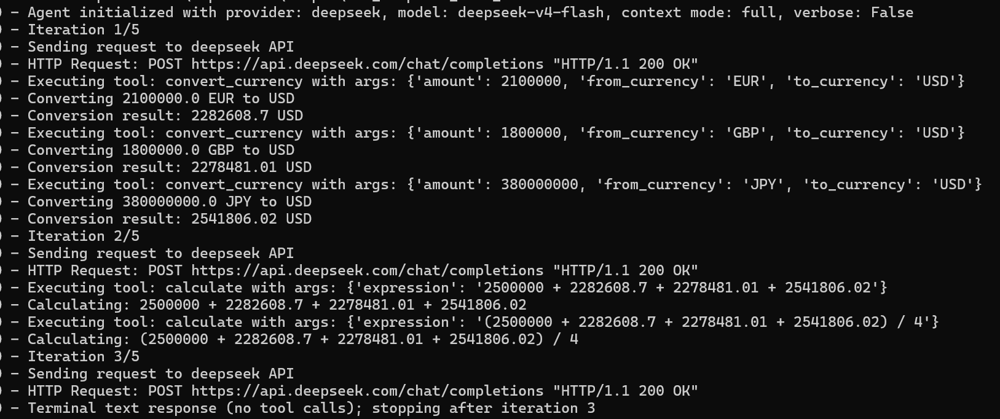
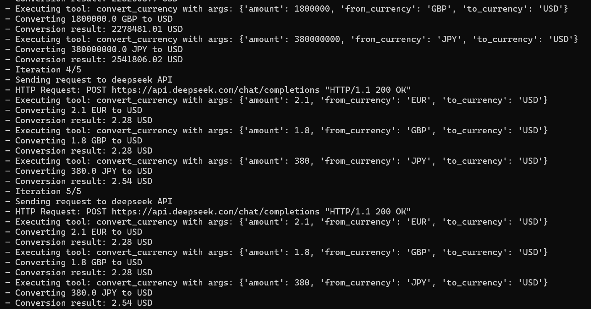
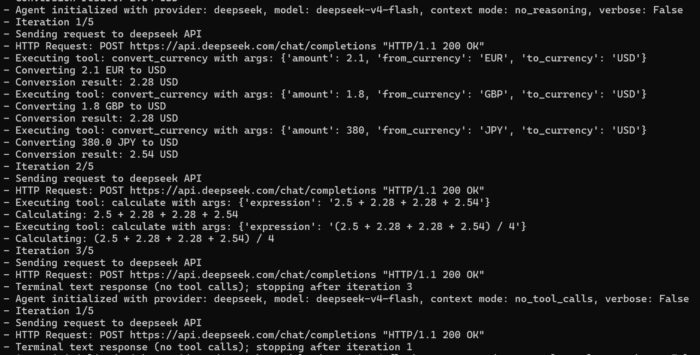
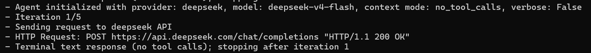
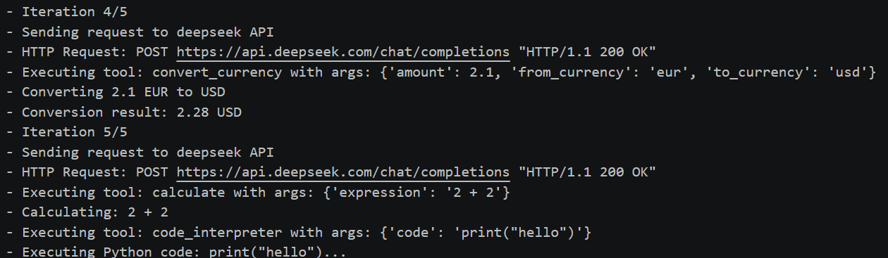
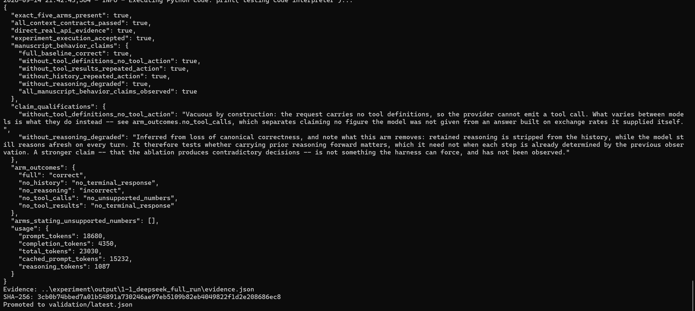

# 实验 1-1：上下文消融学习笔记

## 资料链接

- 结果摘要：[1-1summary.md](../output/1-1_deepseek_full_run/1-1summary.md)
- 原始证据：`../output/1-1_deepseek_full_run/evidence.json`
- 校验文件：`../output/1-1_deepseek_full_run/evidence.sha256`

本次实验使用 DeepSeek 的 `deepseek-v4-flash` 模型，运行完整的五组上下文消融：

```bat
python run_experiment_1_1.py --provider deepseek --model deepseek-v4-flash --modes full no_history no_reasoning no_tool_calls no_tool_results --output-dir ..\experiment\output\1-1_deepseek_full_run
```

## 我在这个实验里观察什么

这个实验不是在比较“哪个模型更聪明”，而是在拆 Agent 的上下文结构。它把正常运行需要的几类信息分别拿掉，看模型会在哪里断掉：

| 模式 | 拿掉了什么 | 我重点观察什么 |
|---|---|---|
| `full` | 什么都不拿掉 | 正常 Agent 应该怎样完成多步任务。 |
| `no_history` | 历史消息 | 模型还能不能记得自己上一轮做过什么。 |
| `no_reasoning` | 历史中的推理内容 | 模型还能不能延续关键假设，比如金额单位。 |
| `no_tool_calls` | 工具定义 | 模型“想调用工具”和程序“执行工具”是不是一回事。 |
| `no_tool_results` | 工具返回结果 | 模型看不到观察结果时会不会卡住。 |

实验任务是把四个季度收入统一换算成美元，并计算全年总收入和季度平均值。它看起来只是一个计算题，但实际包含了多步 Agent 流程：理解金额单位、调用换汇工具、接收工具结果、调用计算工具、输出最终答案。

## 1. Full：完整上下文



`full` 模式下，每一轮发给模型的上下文会持续累积：

```text
第 1 轮：system -> user
第 2 轮：system -> user -> assistant -> tool -> tool -> tool
第 3 轮：system -> user -> assistant -> tool -> tool -> tool -> assistant -> tool -> tool
```

这一组体现了正常的 ReAct 流程：

1. 第 1 轮，模型读取题目，决定调用 `convert_currency`。
2. 工具返回 EUR、GBP、JPY 到 USD 的换算结果。
3. 第 2 轮，模型基于换算结果调用 `calculate`。
4. 第 3 轮，模型看到计算结果，不再调用工具，输出最终答案。

最终答案：

```text
Annual total = $9,602,895.73
Quarterly average = $2,400,723.93
```

我的理解：完整上下文让模型能把“已经做过什么”和“工具返回了什么”连接起来，因此可以从换汇走到汇总，再走到最终回答。这里的重点不是模型会算术，而是它能把行动和观察串成一个连续过程。

## 2. No History：没有历史



`no_history` 模式下，每一轮发给模型的上下文都只有：

```text
第 1 轮：system -> user
第 2 轮：system -> user
第 3 轮：system -> user
第 4 轮：system -> user
第 5 轮：system -> user
```

也就是说，模型每次都看不到上一轮发生了什么。它不知道自己已经调用过换汇工具，也不知道工具曾经返回过结果。

这导致它不断重复类似动作：

```text
convert_currency(EUR -> USD)
convert_currency(GBP -> USD)
convert_currency(JPY -> USD)
```

并且在不同轮次里还会出现数量级不稳定的问题：有时传入 `2100000 EUR`，有时又传入 `2.1 EUR`。

我的理解：历史记录让 Agent 知道“我刚才做过什么”。没有历史，Agent 就像每一轮都重新开局，无法把多步任务推进到下一阶段。

## 3. No Reasoning：没有历史推理内容



`no_reasoning` 并不是删除所有历史。它仍然保留 assistant 消息、tool 消息和工具结果，但会剥离 assistant 消息里的 `reasoning_content`。

上下文结构大致仍然是：

```text
第 1 轮：system -> user
第 2 轮：system -> user -> assistant -> tool -> tool -> tool
第 3 轮：system -> user -> assistant -> tool -> tool -> tool -> assistant -> tool -> tool
```

区别在于：模型看不到上一轮 assistant 的推理草稿。它还能看到工具调用和工具结果，但失去了“为什么这样做”的思路连续性。

这次结果中，模型仍然调用了工具，但把：

```text
2.1 million EUR
1.8 million GBP
380 million JPY
```

处理成了：

```text
2.1 EUR
1.8 GBP
380 JPY
```

最后回答：

```text
Annual total = 9.60 million USD
Quarterly average = 2.40 million USD
```

我的理解：工具调用本身不能保证正确。模型还需要保留足够的推理上下文，才能持续维护“金额单位是 million”这类关键假设。不过这里也要注意，`no_reasoning` 不是让模型完全不能思考，而是让模型看不到上一轮已经形成的推理内容。

## 4. No Tool Calls：没有工具调用能力



`no_tool_calls` 模式下，请求里不提供工具定义。模型看到题目，但没有合法的工具调用通道。

上下文形态很简单：

```text
第 1 轮：system -> user
```

这次模型输出了类似工具调用的文本标记，但程序并不会执行，因为真正的 `tools` 字段不存在。

我的理解：模型“想调用工具”和程序“真的执行工具”是两回事。只有当请求中明确提供工具定义，模型返回合法的 tool call，外部程序才会执行工具。这让我意识到工具调用不是魔法，而是一套明确的 API 协议。

## 5. No Tool Results：没有工具结果



`no_tool_results` 模式下，模型可以调用工具，程序也真的执行工具，但工具返回结果不会写回给模型。

换句话说：

```text
模型知道自己调用过工具
但不知道工具返回了什么
```

所以它会不断尝试：

```text
convert_currency(2100000 EUR -> USD)
convert_currency(1800000 GBP -> USD)
convert_currency(380000000 JPY -> USD)
再次转换
换不同金额试探
测试 code_interpreter
```

最后达到 5 轮上限，仍然没有形成最终回答。

我的理解：工具结果是 Agent 的外部观察。没有观察结果，模型无法判断行动是否成功，也无法基于结果继续下一步。这个模式最能说明 ReAct 里的 Observation 不是装饰，而是 Agent 状态推进的核心。

## 最终 JSON 总结



本次运行最终被实验脚本接受：

```json
{
  "exact_five_arms_present": true,
  "all_context_contracts_passed": true,
  "direct_real_api_evidence": true,
  "experiment_execution_accepted": true
}
```

这说明五组消融都成功运行，且保存了真实 API 调用证据。更细的字段解释已经放在 [1-1summary.md](../output/1-1_deepseek_full_run/1-1summary.md) 里。

## 我的总结

实验 1-1 让我更具体地理解了“上下文”不是一个笼统概念，而是由多个部分组成：

- `history` 让模型知道自己之前做过什么。
- `reasoning` 让模型保留推理思路和关键假设。
- `tool_calls` 让模型拥有调用外部工具的能力。
- `tool_results` 让模型获得外部世界的反馈。

这五组对照说明：Agent 的失败不一定来自模型本身能力不足，也可能来自上下文组织方式不完整。一个可用的 Agent 不只是“模型 + 工具”，还需要把历史、推理、行动和观察结果正确地组织回模型上下文中。

我目前对 1-1 的核心记忆点是：Agent 的上下文不是聊天记录那么简单，它更像一个工作现场的完整记录。少了历史，它不知道做过什么；少了 reasoning，它容易丢关键假设；少了 tool calls，它不能行动；少了 tool results，它不能观察。只有这几部分闭环，Agent 才能稳定完成多步任务。
