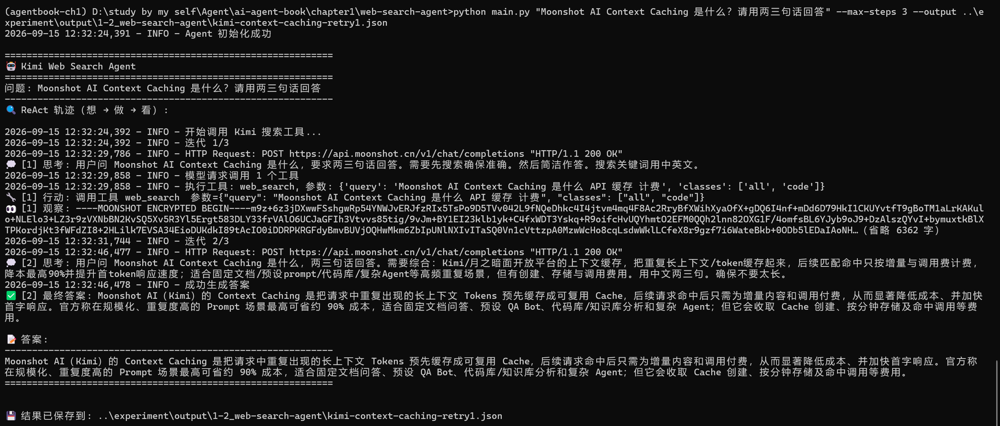

# 实验 1-2：Web Search Agent 学习笔记

## 资料链接

- 结果摘要：[1-2summary.md](../output/1-2_web-search-agent/1-2summary.md)
- 离线示例结果：`../output/1-2_web-search-agent/offline-demo.json`
- 首次真实运行失败结果：`../output/1-2_web-search-agent/kimi-context-caching.json`
- 真实运行成功结果：`../output/1-2_web-search-agent/kimi-context-caching-retry1.json`
- 实验截图：`../images/1-2-kimi-web-search-success.png`

## 实验目的

本实验要观察一个最小 Web Search Agent 是怎样工作的。用户提出问题后，模型不是直接回答，而是先判断是否需要搜索；如果需要，就输出工具调用；程序执行搜索工具，再把搜索结果作为 observation 放回上下文；模型最后根据 observation 生成答案。

这对应 ReAct 的基本流程：

```text
Thought -> Action -> Observation -> Answer
```

与 1-1 不同的是，1-1 的工具是本地的、确定性的汇率转换和计算工具；1-2 的工具是 Moonshot 托管的 `moonshot/web-search:latest`，所以工具结果来自真实网络搜索服务。

## 运行命令

离线演示：

```bat
python main.py --provider offline-demo --output ..\experiment\output\1-2_web-search-agent\offline-demo.json
```

> 离线演示的作用：
离线演示不需要 API Key，也不会真正访问网络。它只是回放一段写好的示例轨迹，用来理解 ReAct 结构。它像一份“结构样例”，告诉我 thought、action、observation、answer 会怎样排列，但不能证明真实搜索服务是否可用。

真实 Kimi 搜索：

```bat
python main.py "Moonshot AI Context Caching 是什么？请用两三句话回答" --max-steps 3 --output ..\experiment\output\1-2_web-search-agent\kimi-context-caching-retry1.json
```

## 真实运行过程



第一次真实运行遇到了服务商限流：

```text
HTTP 429 Too Many Requests
engine_overloaded_error
```

这次失败发生在模型调用阶段，还没有形成 ReAct 轨迹，所以 `trace_count = 0`。

第二次重试成功，使用的是：

```text
provider = moonshot
model = kimi-k3
```

它的 ReAct 轨迹可以简化为：

```text
第 1 轮：模型判断需要搜索 -> 调用 web_search -> 收到 observation
第 2 轮：模型基于 observation 生成最终答案
```

最终答案是：

```text
Moonshot AI（Kimi）的 Context Caching 是把请求中重复出现的长上下文 Tokens 预先缓存成可复用 Cache，后续请求命中后只需为增量内容和调用付费，从而显著降低成本、并加快首字响应。官方称在规模化、重复度高的 Prompt 场景最高可省约 90% 成本，适合固定文档问答、预设 QA Bot、代码库/知识库分析和复杂 Agent；但它会收取 Cache 创建、按分钟存储及命中调用等费用。
```

### 为什么只跑了 2 个 Iteration

一开始我以为 `--max-steps 3` 表示一定会跑 3 轮，但实际它只是上限。

这次成功运行中：

1. 第 1 轮，模型提出搜索动作。
2. 程序执行搜索，并把 observation 写回上下文。
3. 第 2 轮，模型已经拿到足够信息，于是直接输出最终答案。

因为第 2 轮已经完成，程序就不会继续跑第 3 轮。

我的理解：Agent 循环不是固定步数流程，而是“直到模型给出最终答案或达到上限”。`max_steps` 的作用是防止无限循环，不是规定实验必须跑满。

### API 层发生了什么

这次成功运行虽然只有 2 个 ReAct iteration，但底层有 4 个 API turn：

1. 获取 `moonshot/web-search:latest` 的工具定义。
2. 把用户问题和工具定义发给 `kimi-k3`，模型返回 tool call。
3. 调用 Moonshot Formula 执行 `web_search`。
4. 把工具 observation 放回消息历史，再次调用 `kimi-k3` 生成最终答案。

这解释了为什么 JSON 会比 CMD 输出更长：它不仅记录 Agent 表层行为，还记录了背后的服务调用。对我来说，这也说明 Agent 框架本身承担了很多“胶水层”工作：拿工具定义、发模型请求、执行工具、拼接上下文、再次请求模型。

### Rm: JSON 和 CMD 输出的区别

CMD 里展示的是适合人看的轨迹：

```text
思考 -> 行动 -> 观察 -> 答案
```

JSON 保存的是更完整的证据文件，里面主要有两层：

| 字段 | 含义 |
| --- | --- | --- |
| `trace` | 简化后的 ReAct 轨迹，也就是 CMD 中看到的 thought、action、observation、answer。 |
| `api_turns` | 更底层的 API 记录，包括获取工具定义、模型请求、执行 Formula、再次请求模型等。 |

我的理解：CMD 输出帮助我看过程，JSON 文件帮助我证明过程。学习笔记适合引用 summary 和截图；需要追溯细节时再回到原始 JSON。

### Rm: 加密 Observation

真实搜索返回的 observation 是：

```text
----MOONSHOT ENCRYPTED BEGIN----
...
----MOONSHOT ENCRYPTED END----
```

这和 1-1 的本地工具不同。1-1 的工具结果是明文数值，我可以直接看到汇率和计算结果；1-2 的搜索结果由 Moonshot Formula 托管，返回给模型的是加密 observation。作为学习者，我不能直接读出里面所有搜索内容，但可以通过下一轮模型的 thought 和 answer 判断它确实使用了搜索结果。

我的理解：不同工具的 observation 不一定都适合人类直接阅读。有些工具结果主要是给模型继续推理用的，因此学习记录里要区分“我能直接检查的证据”和“模型可消费但我不方便展开的证据”。

## 我的心得

这个实验让我更具体地理解了 Web Search Agent 的运行边界。模型本身并不会“自动上网”，它需要在请求中看到工具定义，然后输出合法的工具调用；真正执行搜索的是外部程序或服务；搜索结果再被写回上下文，模型才有依据继续回答。

我也注意到，Agent 实验不一定每次都成功。429 限流不是代码逻辑错误，而是在线服务调用时很常见的外部不稳定因素。记录失败和重试同样有价值，因为真实 Agent 系统必须面对这类问题。

这一节和 1-1 连起来看，我的理解是：1-1 强调“上下文组成是否完整”，1-2 强调“模型、工具和执行循环怎样协作”。一个 Agent 能工作，不只是因为模型聪明，还因为程序正确地把工具定义、工具调用、工具结果和历史上下文组织成了一个闭环。
