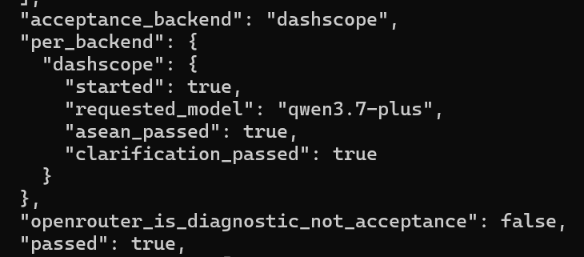

# 实验 1-3：Search + Codegen 深度研究闭环

## 资料链接

- 结果摘要：[1-3summary.md](../output/1-3_search-codegen_dashscope/1-3summary.md)
- 原始证据：`../output/1-3_search-codegen_dashscope/evidence.json`
- 原始 receipts：`../output/1-3_search-codegen_dashscope/receipts.json`
- 运行清单：`../output/1-3_search-codegen_dashscope/manifest.json`

## 运行命令

本次没有使用 OpenAI GPT-5.6 Sol，而是使用仓库支持的等价验收 backend：DashScope `qwen3.7-plus`。

```bat
python run_experiment_1_3.py --backends dashscope --reasoning high --output-dir ..\experiment\output\1-3_search-codegen_dashscope
```

运行结果：



## 实验目标

1-3 要观察的是更接近 Deep Research 的 Agent 能力：

1. 模型自己决定搜索什么。
2. 模型使用 hosted web search 获取最新信息并给出引用。
3. 模型使用 hosted Python/code interpreter 做真实计算。
4. 遇到含糊请求时，模型先澄清，而不是马上乱用工具。
5. 用户补充需求后，通过 `previous_response_id` 继续同一个任务。

这比 1-2 更复杂。1-2 主要是“搜索后回答”，1-3 则是“搜索、计算、验证、澄清、继续”的组合。

### 任务 A：东盟 10 国首都距离

这个任务要求模型搜索东盟 10 国当前官方首都和坐标，然后用 Python 枚举全部 45 对首都之间的距离，找出最近的一对。

本次 evidence 中的关键验证项全部通过：

| 检查项 | 结果 |
| --- | --- |
| 请求成功 | true |
| 模型身份匹配 `qwen3.7-plus` | true |
| 完成 web search | true |
| 完成 code interpreter | true |
| 有 URL 引用 | true |
| 最近首都对匹配独立参考 | true |
| 报告了距离 | true |

最终最近首都对是：

```text
Kuala Lumpur / Singapore
```

注意到模型报告距离约为 `315.55 km`，而脚本内置独立参考距离是 `309.3 km`。这说明不同坐标来源会造成数值差异，但最近首都对一致，所以验收通过。

这个任务的重点是模型要把“搜索来的坐标”交给“代码执行”去枚举 45 对组合，而不是背出答案。所以重点要看 evidence 中是否有 `code_interpreter_call`

### 任务 B：比特币技术分析与澄清

第二个任务故意将问题设置得很含糊：

```text
搜索最近一个月的比特币走势，做技术分析。
```

而模型第一轮没有调用任何工具，而是先问：

```text
您偏好使用哪个数据源（例如 Binance、Coinbase、CoinMarketCap 等）？需要分析哪些技术指标（例如 MA、MACD、RSI、布林带等）？
```

evidence中也有 `first_turn_clarified_before_tools | true` 。也就是说，模型没有急着搜索，而是先确认数据源和指标。

用户补充 CoinGecko、BTC/USD 日线收盘价、MA7、MA20、RSI14、MACD、区间收益、最大回撤之后，模型通过 `previous_response_id` 继续任务，并完成：

```text
web_search_call x 3
code_interpreter_call x 2
```

报告中包含的关键指标有：

| 指标 | 数值 |
| --- | ---: |
| 区间收益率 | +22.78% |
| 最大回撤 | -3.20% |
| MA7 | $77,250.66 |
| MA20 | $78,214.41 |
| RSI14 | 36.45 |
| MACD DIF | 1507.07 |
| MACD DEA | 2247.93 |
| MACD 柱状图 | -1481.72 |

澄清问题是 Agent 可靠性的一个重要部分。用户说“做技术分析”时，如果模型直接动手，很可能会擅自选择数据源和指标；先澄清能让任务边界更明确。
Deep Research 型 Agent 不是一个一次性回答器，而是一个能围绕问题主动补信息、算结果、追溯来源、必要时先问清楚的执行系统。

## 传统 Agent 框架与 Model as agent

回看已经完成的三个实验，它们刚好可以看成 Agent 编排方式逐步变化的过程：

| 实验 | 编排方式 | 重点 |
| --- | --- | --- |
| 1-1 | 更像传统 Agent 框架 | 我们自己的脚本控制 ReAct 循环、工具结果和上下文消融。 |
| 1-2 | 客户端仍然参与循环 | 模型提出 `web_search`，程序调用 Moonshot Formula，再把 observation 交回模型。 |
| 1-3 | 更接近服务端原生 Agent | 模型服务端直接托管 `web_search` 和 `code_interpreter`，客户端主要负责发请求和保存 evidence。 |

这里的“传统框架”指的是客户端自己编排 Agent 的写法。传统框架里，ReAct循环由用户自己编写，Agent 的循环逻辑在应用代码里。而 model 的角色更像“决策大脑”，客户端代码更像“执行器/调度器”。

模型主要负责：

- 理解用户任务。
- 根据上下文 reasoning。
- 判断下一步该做什么。
- 选择是否调用工具。
- 生成工具参数。
- 看到工具结果后继续推理。
- 最后组织自然语言答案。

客户端代码主要负责：

- 把历史消息、工具定义、工具结果拼成上下文。
- 调用模型 API。
- 解析模型输出里的 tool call。
- 真正执行工具。
- 把工具结果再塞回模型上下文。
- 控制循环是否继续。

Rm: 如前所述，模型的输入通常不是单纯一句自然语言，而是“语言 + 结构化工具定义 + 历史消息”的组合，例如：

```text
system: 你是一个会使用工具的 Agent
user: 搜索最近一个月比特币走势并分析

tools:
  web_search(query)
  code_interpreter(code)

history:
  assistant 调用了 web_search
  tool 返回了价格数据
```

模型的输出也不一定只是普通文本，通常有两类：

```text
1. 普通文本回答。
2. 结构化 tool call，例如调用 `web_search` 或 `code_interpreter` 的函数名和参数。
```

而 model-as-agent / 原生工具路线里，模型服务商把更多循环和工具执行能力内置到了 API 服务端，客户端更像是在请求一个已经内置工具闭环的研究系统。而这些请求是否成功，不能只看 Agent 的最终回答写得像不像。真正要看的是 evidence 里有没有完成的 `web_search_call`、`code_interpreter_call`、引用、continuation，以及验证脚本是否通过。
