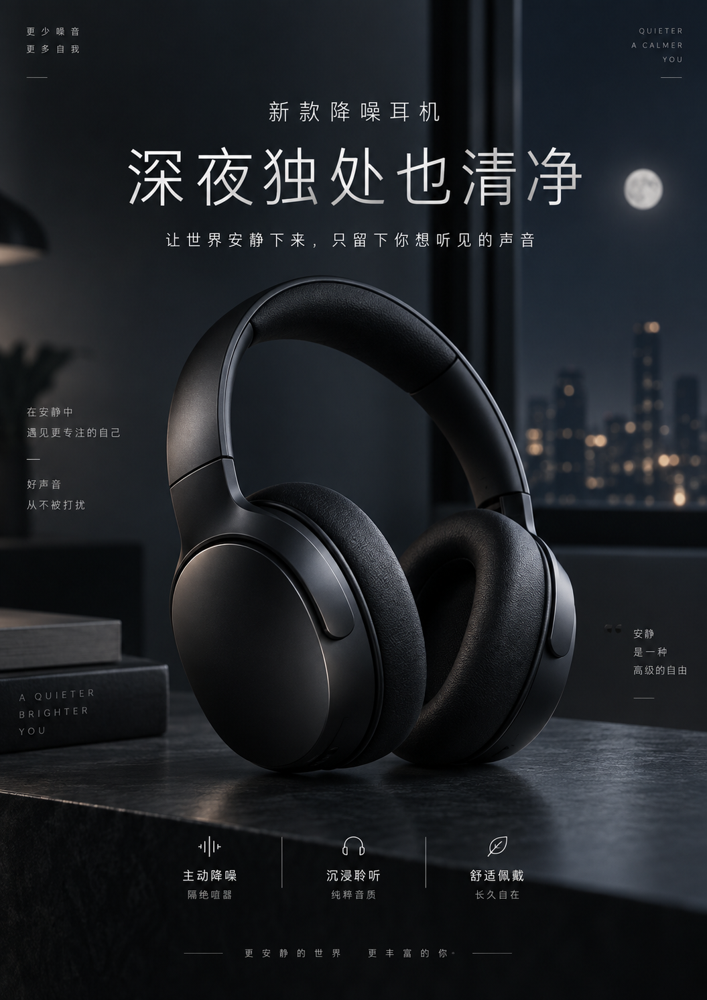

# 实验 1-4：文生图工作流与原生路线对照

## 资料链接

- 结果摘要：[1-4summary.md](../output/1-4_image-gen-workflow/1-4summary.md)
- 成功运行原始证据：`../../image-gen-workflow/validation/real_20260916T064008Z/evidence.json`
- 失败运行原始证据：`../../image-gen-workflow/validation/real_20260916T063808Z/evidence.json`
- 生成图片：`../images/1-4-headphone-poster-workflow.png`

本次实验只跑了 `headphone-poster` 需求的 `workflow` 路线。因为没有OpenAI的API，所以只是在 ChatGPT 对话框中手动使用原生图像生成能力补充了一张观察样例。

## 实验目标

1-4 想比较两种图像生成方式：

| 路线 | 流程 | 观察重点 |
| --- | --- | --- |
| `workflow` | 用户需求 -> Kimi 改写 prompt -> DashScope 万相生成图片 | 改写节点是否忠实保留原始需求，是否做了有用的适配。 |
| `native` | 用户需求 -> Gemini 图像模型直接出图 | 原生图像模型是否能直接理解口语化中文需求。 |
| `native_gptimage` | 用户需求 -> GPT-Image 直接出图 | 原生多模态模型是否能同时处理图像、文字和版式需求。 |

## 运行命令

第一次运行失败：

```bat
python main.py --route workflow --requirement headphone-poster
```

失败原因是 Kimi 改写节点鉴权失败：

```text
401 Invalid Authentication
```

清掉错误的 `KIMI_API_KEY` 并正确设置 Moonshot/Kimi key 后，第二次运行成功：

```bat
python main.py --route workflow --requirement headphone-poster
```

终端结果：

```text
run_id=20260916T064008Z  需求 1 句 × 路线 ['workflow']

=== [workflow] headphone-poster: 帮我做一张新款降噪耳机的产品海报，主打“深夜独处也清净”这句文案，风格简约高级
    -> outputs\20260916T064008Z\images\headphone-poster_workflow.png (871085 bytes)

完成: 1/1 次运行成功
```

## 生成结果

### Workflow


图片视觉上是一个黑色头戴降噪耳机产品图，背景是深夜星空、月环和水面反射。整体质感很高级，符合“深夜”“独处”“清净”“简约高级”的氛围。

但是图片中没有出现原始需求指定的中文文案：

```text
深夜独处也清净
```

### 手动 native 路线对照



这张图不是 `main.py` 通过 API 自动生成的 evidence，而是我在 ChatGPT 对话框中手动使用原生图像生成能力补充的一张观察样例。因此它不能替代程序里的 `native_gptimage` 路线证据，但可以作为学习对照。

与 workflow 结果相比，这张手动原生图有几个明显差异：

| 对比点 | Workflow 路线 | 手动 GPT 原生图像路线 |
| --- | --- | --- |
| 产品主体 | 黑色头戴降噪耳机，质感高级 | 黑色头戴降噪耳机，质感高级 |
| 夜晚氛围 | 星空、月环、水面反射，氛围强 | 室内深夜、窗外月亮和城市灯光，海报感强 |
| **中文主文案** | 没有出现 | 清晰出现“深夜独处也清净” |
| 海报版式 | 更像一张产品概念图，留白供后期排版 | 更像完整广告海报，已有标题、副文案、卖点区 |
| 需求忠实度 | 视觉氛围忠实，但文案需求缺失 | 同时保留产品、氛围和核心文案 |

这说明原生图像模型在“含明确中文文案的海报任务”上更接近用户想要的一步到位结果。它不需要把文案先拆成 SD 风格 tag，也没有把 `text` 当作负面词排除，而是直接把文字作为海报设计的一部分来处理。

不过也需要注意，这张图是手动对照，不包含程序记录的 request、response id、image hash、route 等字段，因此只能帮助我理解两类路线的能力差异。

## 改写节点做了什么

原始需求是：

```text
帮我做一张新款降噪耳机的产品海报，主打“深夜独处也清净”这句文案，风格简约高级
```

Kimi 改写后的 `prompt` 主要保留了这些视觉元素：

- 新款无线降噪耳机。
- 哑光黑、高级产品摄影。
- 深夜蓝渐变背景。
- 柔和月光轮廓光。
- 安静、孤独、清净的夜晚氛围。
- 简约高级广告海报风格。
- 大面积留白和 copy space。

但它的 `negative_prompt` 里包含：

```text
text, logo, signature
```

而 `style_notes` 明确说明：

```text
因模型生成文字易出错，负面词中排除 text/watermark，建议文案后期手动添加。
```

这说明改写节点做了一个取舍：它认为传统文生图模型不擅长稳定生成文字，所以主动把“文案”从图片生成任务里移除，只保留了适合后期排版的留白。

## 我的理解

这个结果很好地体现了 workflow 路线的优点和风险。

优点是：改写节点把一句口语化中文需求变成了经典文生图模型更容易理解的英文 tag，把“深夜独处也清净”转成了夜晚、月光、静谧、留白、产品摄影等视觉语言。因此生成图的产品质感和氛围是成功的。

风险是：改写节点也可能改变任务边界。用户明确说“主打这句文案”，但改写节点为了适配旧式文生图模型，把文字需求放进了 negative prompt。这样图片看起来像海报，但不是一张完成的产品海报，因为核心文案缺失。
