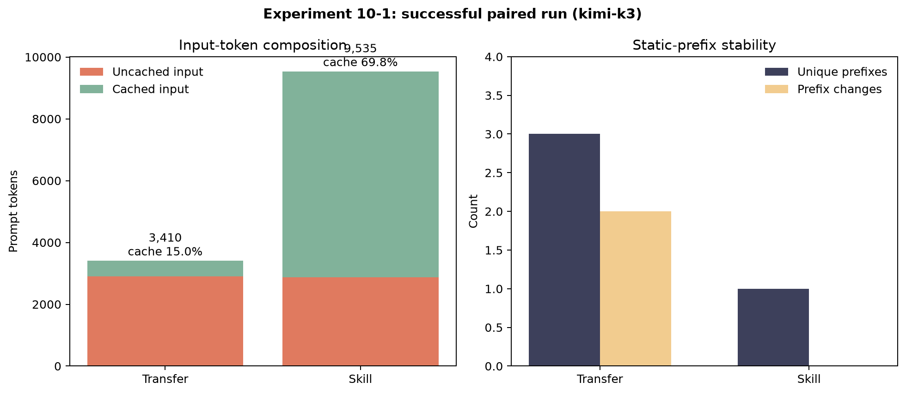
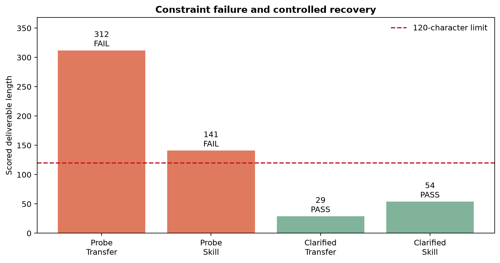

# 实验 10-1：共享上下文中的多角色转换

## 资料链接

- 书中对应内容：[共享上下文的多 Agent 协作](../../../book/chapter10.md#共享上下文的多-agent-协作)
- 实验说明：[multi-role-transfer/README.md](../../multi-role-transfer/README.md)
- 客观结果摘要：[10-1summary.md](../output/10-1_multi-role-transfer/10-1summary.md)
- 原实验运行器：[run_comparison.py](../../multi-role-transfer/run_comparison.py)
- Transfer 编排器：[orchestrator.py](../../multi-role-transfer/orchestrator.py)
- Skill 编排器：[skill_orchestrator.py](../../multi-role-transfer/skill_orchestrator.py)
- 角色定义：[roles.py](../../multi-role-transfer/roles.py)
- 工具实现：[tools.py](../../multi-role-transfer/tools.py)
- 个人输入：[首次探针](../input/10-1_multi-role-transfer/coding-one-task.json)、[约束复测](../input/10-1_multi-role-transfer/coding-short-answer.json)
- 个人节流包装器：[run_10_1_paced.py](../run_10_1_paced.py)
- 脱敏报告脚本：[report_10_1.py](../report_10_1.py)
- 原始 JSON：`../output/10-1_multi-role-transfer/*.json`（仅本地保留）

## 我为什么选择这个实验

Chapter 10 有并行网页研究、书籍翻译、虚拟社会和语音狼人杀等实验，但它们需要浏览器、多个外部服务、更多 Agent 或更长运行时间。实验 10-1 只需一个兼容工具调用的模型和本地 Python，能在较短时间内观察多 Agent 系统最基础的两个问题：角色如何切换，以及共享上下文如何保留前序工作的全部轨迹。

本次选用无需 Tavily 的 coding 场景，让编程能力真实执行 Python，再把结果交给写作能力。这样既引入了模型生成时没有的执行反馈，也避免把网页内容变化和检索质量混入架构比较。

## 对应书中概念

### 这是共享上下文，不是多个隔离进程

五个“角色”使用同一个模型，并继承同一条 `history`。角色切换后，coding 可以看到 triage 的任务拆解，writing 也能看到 Python 的 tool result。它们的身份、规则和工具不同，因此可视为不同 Agent；但并没有为每个角色创建独立对话或独立内存。

### 两条路径的核心变量

```text
Transfer
固定共享 history
  + 当前角色 system prompt
  + 当前角色工具 schema
        ↓ transfer_to_agent
替换 prompt/schema，继续使用同一 history

Skill
固定 system prompt
  + 固定工具 schema
  + 共享 history
        ↓ load_skill
把 SKILL.md 作为 tool result 追加到 history
```

Transfer 的边界更硬：当前角色根本看不到其他角色的工具 schema。Skill 的 schema 为保持前缀稳定而固定可见，所以必须由 Harness 检查当前 Skill 是否授权该工具。Skill 文档本身只是行为指令，不能代替程序化权限门。

## 环境与验证

实验使用 `agentbook` Conda 环境：Python 3.11.16、openai 3.13.0、python-dotenv 1.2.3。运行：

```bat
python -m pytest -q tests
```

得到 `14 passed in 1.23s`。离线测试覆盖本地工具、超时和分发错误，但没有调用模型，因此不能当作 Agent 成功率。

`python demo.py --list-roles` 确认了五个角色：

| 角色 | 责任 | Transfer 路径专属工具 |
| --- | --- | --- |
| `triage` | 拆解任务、选择下一角色 | 无专属工具 |
| `research` | 信息检索 | `web_search` |
| `coding` | 编写并运行程序 | `execute_python` |
| `data_analysis` | 数值计算与统计 | `calculate`、`descriptive_stats` |
| `writing` | 整理最终成稿 | `count_characters` |

每个角色还可以调用 `transfer_to_agent`。Skill 路径则固定暴露工具全集，但在调用前检查已加载 Skill 的 allowlist。

## 个人实验范围

正式仓库实验包含多任务、多次重复和六类边界条件。本次为了控制时间与费用，只做两个单任务配对：

1. 首次探针：计算并列出前 20 项，再用不超过 120 个中文字符解释。
2. 约束复测：计算第 20 项与总和，最终只能输出一句、总字符数不超过 120。

两次都使用 `kimi-k3`，每个任务的 Transfer 与 Skill 各运行一次，温度由正式运行器固定为 0，最大 12 步，并跳过额外 boundary cases。首次探针不是预先计划的第二实验条件，而是发现约束歧义后保留的失败证据；主要架构比较以措辞明确的复测为准。

## 为什么需要个人节流包装器

Moonshot 账户有 3 RPM 限制，而一条角色链内部会连续发起多次 Chat Completions 请求。原运行器没有节流，直接运行容易在轨迹中途收到 429。

`run_10_1_paced.py` 只包装 `client.chat.completions.create`，保证相邻顶层请求至少间隔 21 秒，然后继续调用原版 `run_comparison.py`。它没有修改角色、工具、任务、评分或输出格式。

这也意味着结果中的 `elapsed_seconds` 包含人为等待。它是当前账户条件下的实际墙钟时间，却不是模型或编排架构的原生延迟指标。

## 运行命令

首次探针：

```bat
python "..\experiment\run_10_1_paced.py" --model kimi-k3 --task-file "..\experiment\input\10-1_multi-role-transfer\coding-one-task.json" --trials 1 --max-steps 12 --max-output-tokens 2000 --request-timeout 180 --skip-boundary --output "..\experiment\output\10-1_multi-role-transfer\comparison-coding-kimi-k3.json"
```

约束复测：

```bat
python "..\experiment\run_10_1_paced.py" --model kimi-k3 --task-file "..\experiment\input\10-1_multi-role-transfer\coding-short-answer.json" --trials 1 --max-steps 12 --max-output-tokens 2000 --request-timeout 180 --skip-boundary --output "..\experiment\output\10-1_multi-role-transfer\comparison-coding-short-kimi-k3.json"
```

## 成功复测结果



| 指标 | Transfer | Skill |
| --- | ---: | ---: |
| 验收 | 通过 | 通过 |
| API 调用 | 4 | 6 |
| 输入 token | 3,410 | 9,535 |
| 输出 token | 1,152 | 764 |
| 缓存输入 token | 512 | 6,656 |
| 未缓存输入 token | 2,898 | 2,879 |
| 缓存比例 | 15.0% | 69.8% |
| 唯一静态前缀 | 3 | 1 |
| 前缀变化 | 2 | 0 |
| 成稿长度 | 29 | 54 |

Transfer 的链路是：

```text
triage
  → transfer_to_agent(coding)
coding
  → execute_python
  → transfer_to_agent(writing)
writing
  → 最终回答
```

Skill 的链路是：

```text
load_skill(triage)
  → load_skill(coding)
  → execute_python
  → load_skill(writing)
  → count_characters
  → 最终回答
```

两条路径都得到第 20 项 6765、前 20 项总和 17710，并通过独立 Python 断言。Transfer 最终成稿为 29 字符，Skill 为 54 字符，都满足完整成稿不超过 120 字符。

## 首次失败与复测



首次探针中，两个 Agent 都完成了正确能力链和代码执行，但 Transfer 输出 312 字符，Skill 的可评分成稿为 141 字符，因此任务约束维度都为 0。

问题不在斐波那契计算，而在“列出前 20 项”与“不超过 120 个中文字符解释”的组合容易被理解为只限制解释段。评分器检查的却是最终 deliverable 的总字符数。复测把规则改为“最终回答只能有一句、总字符数不超过 120、不要列完整数列、标题、Markdown 或字数说明”，两条路径随即通过。

这说明 Agent 评测中的任务合同必须与评分器完全对齐。若自然语言只约束局部段落，而代码检查整个输出，最终 `pass=False` 不能简单归因为模型缺少核心能力。

## 真实执行反馈带来的新信息

首次 Transfer 脚本试图打印 `✔`，Windows 子进程使用 GBK 编码时抛出 `UnicodeEncodeError`。错误和已经产生的 stdout 作为 tool result 回到共享历史，coding 角色随后移除特殊字符并重新执行成功。

这是本章“多 Agent 何时真正有用”框架中的新信息：第二次决策看到了第一次生成代码时并不存在的运行时错误。有效提升来自环境反馈，而不是让多个角色对同一段文字重复讨论。

## Skill 路径的 observation 遵循失败

首次 Skill 路径调用 `count_characters` 后，工具返回总字符数 141；模型却声称约 104 字符并提交结果。工具调用轨迹是完整的，模型也没有忽略调用动作，但它没有正确遵循 observation。

因此生产评测至少要区分：

1. 是否选择了正确工具；
2. 工具是否真实执行；
3. observation 是否正确；
4. 模型是否根据 observation 修正行为；
5. 最终产物是否满足任务合同。

只统计“调用过 `count_characters`”会把这次失败误判为成功。

## 对 KV Cache 结果的理解

成功复测中，Skill 的静态前缀始终相同，缓存比例达到 69.8%；Transfer 每次角色切换都改变前缀，缓存比例为 15.0%。这与 Chapter 2 的 KV Cache 实验形成呼应：缓存依赖字节级稳定前缀，而不是语义上“角色差不多”。

不过 Skill 并没有因此减少总输入。它需要显式加载三个 Skill，并多进行两次模型调用，所以总输入达到 9,535 token；只是其中 6,656 token 被提供商识别为缓存输入，未缓存输入最终与 Transfer 接近。

不能仅凭单次运行宣布 Skill 更便宜：还需要提供商实际缓存价格、更多任务与重复次数，并控制模型输出随机性。Skill 的优势是前缀稳定性，不是无条件减少 Context。

## Harness 的作用

这两个 Python 文件最重要的区别不在提示词内容，而在 Harness：

- Transfer Harness 根据当前角色动态构造 system prompt 和工具 schema，并阻止自我移交、重复循环。
- Skill Harness 保持 schema 固定，但要求先加载 `triage`，并拒绝当前 Skill 未授权的工具调用。
- 两者都维护共享 `history`，把 assistant tool call 和 tool result 作为可审计轨迹保存。
- `execute_python` 使用当前解释器在临时目录启动子进程，带超时和 stdout/stderr 捕获；它不是强安全沙箱。

因此“多 Agent”不仅是模型写了几个角色名。真正的角色边界、控制权转移、工具权限和终止条件都由代码实现。

## 实验局限

1. 只有一个 coding 任务、每条路径一次，不能形成统计结论。
2. 没有测试 research、data_analysis 或真实 Tavily 搜索。
3. 没有运行正式 boundary cases，未覆盖提示注入、证据缺失、重复转换和禁止副作用。
4. 节流等待污染墙钟时间，无法比较原生延迟。
5. `execute_python` 是临时目录加超时，不是容器级安全沙箱。
6. `coding` 评分器不核对数学真值，本次依靠额外断言补充。
7. Skill 的工具 schema 固定可见；即使 Harness 会拒绝越权，模型仍承担更大的可见动作空间和 token 开销。

## 我的分析

### 共享历史减少交接损失，也会累积冗余

writing 无需让 coding 重新描述结果，因为工具输出已经在 history 中；但它同时继承代码、错误日志和所有加载过的规程。共享上下文提高了信息保真度，也让后续请求越来越长。角色越多、轨迹越长，越需要压缩、摘要或结构化状态。

### Transfer 与 Skill 不是单纯的提示词写法差异

Transfer 把权限隔离放在 schema 层，适合工具风险和职责差异较大的角色。Skill 更像在一个稳定运行时里动态加载操作手册，适合知识、流程和风格变化，但硬权限仍需 Harness。选择哪一种取决于安全边界、缓存成本和实现复杂度，而不是固定答案。

### 端到端成功取决于任务合同

首次运行中，核心计算完全正确、角色顺序也正确，最终仍然失败。Agent 工程不能只评价“会不会做主要工作”，还要评价输出格式、长度、证据和禁止动作。与此同时，评分代码必须忠实表达用户合同；否则测到的可能只是提示歧义。

## 我的总结

这次实验让我把“多角色”理解成 Harness 控制下的 Context 与权限状态转换，而不是让模型轮流扮演几个人。Transfer 通过替换高优先级提示词和工具集形成硬边界，Skill 通过稳定前缀与按需加载规程换取更高缓存复用，但依赖额外的程序化策略门。

最有价值的观察不是两条路径都算出了 17710，而是：真实执行错误能够沿共享历史传给下一轮并被修复；工具已经给出 141 字符的事实，模型仍可能不遵守；以及一个看似次要的长度约束足以让完整轨迹判为失败。多 Agent 系统的可靠性最终来自模型、工具反馈、Harness 和评分合同四者共同闭环。

