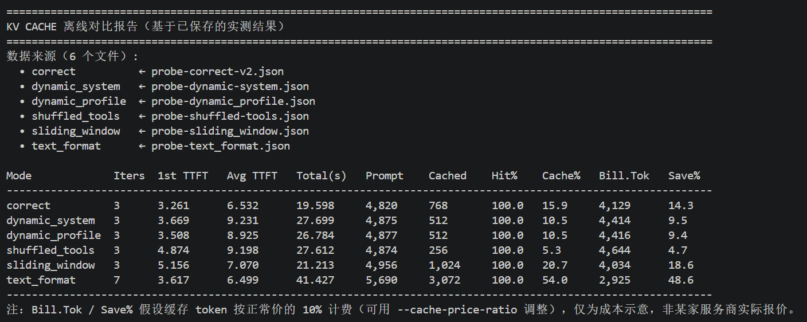
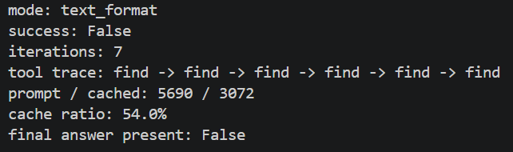

# 实验 2-3：KV Cache 友好的上下文设计

## 资料链接

- 书中对应章节：[KV Cache 友好的上下文设计](../../../book/chapter2.md#kv-cache-友好的上下文设计)
- 实验说明：[chapter2/kv-cache/README.md](../../kv-cache/README.md)
- 客观结果摘要：[2-3summary.md](../output/2-3_kv-cache/2-3summary.md)
- 实验入口：[main.py](../../kv-cache/main.py)
- Agent 与工具实现：[agent.py](../../kv-cache/agent.py)
- 原始 JSON：`../output/2-3_kv-cache/probe-*.json`（仅本地保留）

## 对应书中内容

本实验对应第二章“KV Cache 友好的上下文设计”。书中强调，模型服务处理上下文时会按 token 前缀计算注意力的 Key/Value 表示；当后续请求拥有完全相同的前缀时，服务端有机会复用此前计算，减少重复计算。系统提示、工具定义、历史消息的内容与顺序都会影响前缀是否仍然相同。

这里还要区分两个层次：推理引擎内部的 KV Cache 是注意力计算产生的 K/V 张量；API 返回的 `cached_tokens` 是服务商对跨请求 Prompt Cache 命中的计量。本实验直接观察的是后者，并用它作为前缀复用的外部证据，而不是直接读取 GPU 显存中的 KV 张量。

## 实验目的

本实验比较六种上下文构造模式：

| 模式 | 改变量 |
| --- | --- |
| `correct` | 固定 system prompt、固定工具顺序、保留结构化完整历史，并在同一消息列表上追加。 |
| `dynamic_system` | 每轮在 system prompt 中加入新的高精度时间戳。 |
| `dynamic_profile` | 每轮在靠前位置插入余额递减的用户资料消息。 |
| `shuffled_tools` | 每次请求随机打乱相同工具定义的顺序。 |
| `sliding_window` | 只保留最近 6 条历史消息，同时避免留下没有配对 assistant tool call 的孤立 tool 消息。 |
| `text_format` | 把结构化 assistant/tool 历史重新拼成一个普通 user 文本块。 |

需要回答的问题有两个：一是这些改动怎样影响服务端上报的缓存 token；二是即使缓存指标看起来很好，Agent 是否仍然能够沿着正确工具轨迹完成任务。

## 环境与运行命令

实验环境：

```text
Windows
Conda 环境：agentbook
Python：3.11.16
模型：kimi-k2.6
API：Moonshot
根目录：chapter2/kv-cache
账户限流：3 RPM
```

最初运行时，`agentbook.providers` 无法导入。原因不是 Moonshot API 或模型错误，而是仓库根目录的共享包没有注册进当前环境。确认解释器属于 `agentbook` 后，使用以下命令安装本地 editable package，且不更新第三方依赖：

```bat
python -m pip install -e ..\.. --no-deps
```

正式对照使用一个限制在三轮内的固定任务：第一轮只执行一次 `find`，第二轮并行读取 `main.py` 与 `agent.py` 的前 120 行，第三轮生成三句话总结。六种模式的模型、任务、工具根目录均保持一致。

示例命令：

```bat
python main.py --no-interactive --mode correct --model kimi-k2.6 --root-dir . --task "First call find exactly once to list *.py files. Then, in one assistant turn, call read_file for main.py and agent.py with offset 0 and size 120. Do not read any additional ranges. Finally summarize only the inspected portions in exactly 3 sentences." --output "..\experiment\output\2-3_kv-cache\probe-correct-v2.json"
```

其他模式只替换 `--mode` 和输出文件名。由于账户每分钟最多接受 3 次请求，当前 `--compare` 又没有请求级节流，六组分别运行并在组间等待；否则第二组开始时就会把限流误当成模式失败。

## 实际运行过程

### 第一次正确模式探针：为何进入第四轮

第一次任务要求读取整个 `main.py` 和 `agent.py`。第一轮执行 `find`，第二轮读取两个文件；虽然日志显示读到全部行数，但 `read_file` 会把返回给模型的正文限制在约 10 KB。模型在第三轮观察到截断，因此又请求两个后续区段。第三轮仍然含有 tool calls，Harness 必须将新 observation 回填并发起第四轮，模型才有机会给最终答案。

第四轮成为一分钟内的第 4 次模型请求，Moonshot 返回 429。SDK 的一秒级重试没有跨过 RPM 窗口，所以探针以 `success=false` 结束。这个失败说明：`iteration` 统计的是模型请求轮次，而一次 iteration 可以包含多个工具调用；只要模型仍返回 tool calls，循环就必须继续。

### 修正后的正确模式

修正任务把每个文件限制为前 120 行，轨迹变成：

```text
Iteration 1
模型：提出 find("*.py")
Harness：在本地目录查找文件
Observation：找到 17 个 Python 文件

Iteration 2
模型：在同一响应中提出两个 read_file 调用
Harness：分别读取 main.py 与 agent.py 的前 120 行
Observation：两个结构化文件结果

Iteration 3
模型：输出三句话总结，不再提出工具调用
Harness：把无 tool_calls 的内容视为最终答案并停止
```

第二轮有 256 cached tokens，第三轮有 512 cached tokens。随着稳定历史增长，可复用的前缀也增长。第三轮 TTFT 仍然变长，因为 prompt 与 completion 都更大，且推理模型本身存在延迟波动；缓存命中不保证每一轮墙钟时间都比上一轮短。

### 六模式结果

| 模式 | 成功 | 工具轨迹 | Cache ratio | 总时间 |
| --- | :---: | --- | ---: | ---: |
| `correct` | 是 | `find -> read_file × 2 -> answer` | 15.9% | 19.598s |
| `dynamic_system` | 是 | `find -> read_file × 2 -> answer` | 10.5% | 27.699s |
| `dynamic_profile` | 是 | `find -> read_file × 2 -> answer` | 10.5% | 26.784s |
| `shuffled_tools` | 是 | `find -> read_file × 2 -> answer` | 5.3% | 27.612s |
| `sliding_window` | 是 | `find -> read_file × 2 -> answer` | 20.7% | 21.213s |
| `text_format` | 否 | `find × 6 -> 429` | 54.0% | 41.427s |

完整 token、TTFT 与缓存数值见结果摘要。

## 截图

### 六模式离线对比



这张表来自六份个人实测 JSON 的离线汇总。内置表格没有显示 `success` 字段，因此必须结合 summary 阅读：其中 `text_format` 的 `success=false`，不能因为它的 `Cache%` 最高就判为最佳模式。

### `text_format` 重复调用



脱敏后的 JSON 解读显示，`text_format` 连续执行六次 `find`，没有 `read_file`，也没有最终答案。这说明高缓存比例与有效任务进展是两个不同维度。

终端 429 原文含组织与 Key 标识，不能直接进入截图。截图应使用脱敏后的离线 JSON 解读输出，或裁掉错误详情。

## JSON / evidence 解读

原始 JSON 的顶层字段包括：

| 字段 | 含义 |
| --- | --- |
| `success` | 是否在退出前得到无 tool call 的最终答案。 |
| `final_answer` | 成功时的最终文本；失败运行为空。 |
| `iterations` | 进入模型请求循环的轮数，包括最后发生异常的轮次。 |
| `tool_calls` | 本地 Harness 实际执行的工具调用及其参数、结果。 |
| `metrics` | 聚合 TTFT、token、cache hit/miss 与 cached token。 |
| `mode` | 当前上下文构造模式。 |

本次 JSON 没有写入模型名、原始任务和 429 错误详情，因此不能只靠 JSON 重建全部 provenance。summary 同时保存固定任务、模型与运行命令。终端输出用于解释逐轮 cached tokens 和限流，JSON 用于核对成功状态、最终答案、工具轨迹和聚合指标。

内置报告的 `Hit%` 在六组中都是 100%，但这并不表示每一轮全部命中。代码只用已记录的 `cache_hits` 与 `cache_misses` 作为分母；未上报 `cached_tokens` 的轮次可能两者都不增加。相比之下，`cached_tokens / prompt_tokens` 得到的 `Cache ratio` 更适合本实验。

## 我的分析

### 缓存匹配的是 token 前缀，不是“语义相同”

`correct` 与 `shuffled_tools` 都完成相同任务，也调用相同三个工具，但 shuffled 模式的 cached tokens 从 768 降至 256。对模型服务而言，“工具集合相同但顺序不同”不是同一个 token 前缀。缓存不会先理解两份工具定义在语义上等价，再决定复用；它依赖精确的序列前缀。

同样，客户端是否创建了一个新的 Python `list` 不是服务端缓存判断依据。只要序列化后的请求 token 完全相同，重新创建本地对象也可以命中；真正破坏缓存的是时间戳、余额、工具顺序、历史裁剪和角色格式等内容变化。

### 动态信息的位置决定损失范围

动态 system/profile 两组仍各有 512 cached tokens，没有归零。这支持一个更精确的理解：前缀缓存在第一个变化点之前仍可复用，变化点之后才需要重新计算。因此生产系统不应把时间、余额、实时传感器值等高频变化字段放在稳定前缀的前部；可以把稳定政策和工具定义放前面，把动态状态放在靠后的状态块或最新 observation 中。

不过，后运行模式在第一轮已经出现 256 cached tokens，说明服务端可能复用了前面独立运行留下的共同前缀。该实验按固定顺序各跑一次，存在跨运行预热效应，不能把绝对差值全部归因于模式。

### 高缓存率可能对应无效循环

`text_format` 的 cache ratio 最高，但它连续六次重复 `find`，没有执行任何 `read_file`，也没有最终答案。结构化 assistant tool call 与 tool result 被压成普通 user 文本后，模型失去了协议层清晰的“我做过什么、环境返回了什么”，于是每轮看到重新附加的任务，又从第一步开始。

这与第一章上下文消融实验中的 `no_tool_results` 很相似：工具实际上执行了，但若 observation 没有以模型能可靠识别的结构回到 Context，Agent 就可能重复行动。缓存只优化重复计算，不保证被缓存的内容是正确、有用或能推进任务的。

### 滑动窗口结果是一次未激活的负面检查

`sliding_window` 的 cache ratio 达到 20.7%，但在最终回答前历史只有 5 条消息，低于代码保留的最近 6 条，因此没有真正删除任何历史。该结果只能说明“配置为滑动窗口的代码在这个短任务上完成了”，不能说明裁剪历史提高了缓存效率，更不能推翻长任务中滑动窗口可能破坏行动—观察配对的风险。

## 实验局限

1. 每个模式只运行一次，没有重复试验、置信区间或显著性检验。
2. 六组按固定顺序分别运行，不是同一 `--compare` 进程；跨运行缓存预热可能影响后运行模式。
3. 各模式 completion tokens 从 763 到 1,117 不等，TTFT 和总时间差异不能全部归因于缓存。
4. `sliding_window` 没有跨过 6 条历史消息阈值，未充分激活实验变量。
5. `text_format` 的行为退化真实可见，但最终停止原因是 429；不能证明在没有限流时它必然失败。
6. 任务只读取两个文件各 120 行，不能代表长上下文、长工具轨迹或生产负载。
7. API 只提供聚合 cached tokens，没有暴露具体缓存块、失效点或 GPU KV Cache 状态。
8. JSON 缺少模型、任务、逐轮 token/cache 明细和异常字段，需要 summary 与终端证据补足。

## Embodied AI 迁移理解

在机器人 Agent 中，稳定前缀可以包含安全规则、机器人能力说明、动作工具 schema 和固定坐标系约定；这些内容应尽量保持顺序和文本稳定。电量、关节温度、障碍物位置和当前抓取状态属于动态世界状态，应该作为靠后的最新 observation 注入，而不是每轮改写最前面的系统提示。

`text_format` 的失败也可以映射到物理行动：如果机器人把“已发送抓取动作”和“夹爪返回失败”压成一段无角色的叙述，模型可能无法可靠识别动作已经执行，从而重复抓取。对于高风险动作，assistant action、工具执行结果、时间戳和传感器 observation 必须保持结构化且可审计；缓存命中再高，也不能替代当前世界状态验证。

滑动窗口则可能删除早期安全约束或把 action 与 observation 拆开。生产系统需要按语义保留关键状态与成对事件，而不是只按消息条数截断。

## 我的总结

这次实验让我看到，KV Cache 友好设计并不是简单地“缩短 prompt”。服务端复用的是精确且连续的 token 前缀，因此工具定义顺序、动态字段位置和消息角色结构都是架构约束。

更重要的是，缓存效率必须与任务成功一起判断。`text_format` 缓存比例最高却陷入重复调用，`sliding_window` 看似表现很好却根本没有触发裁剪。对 Agent 来说，正确的上下文语义和完整的行动—观察闭环优先于单一缓存指标；缓存是在正确轨迹上的性能优化，而不是正确性的替代品。
