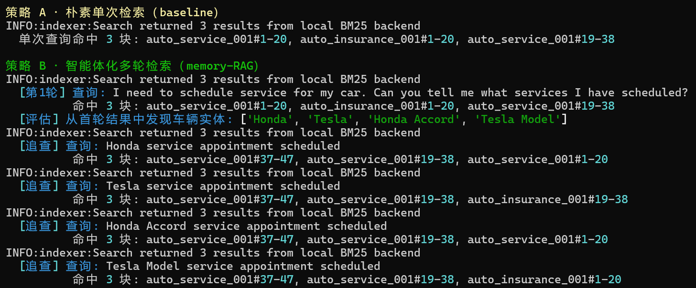
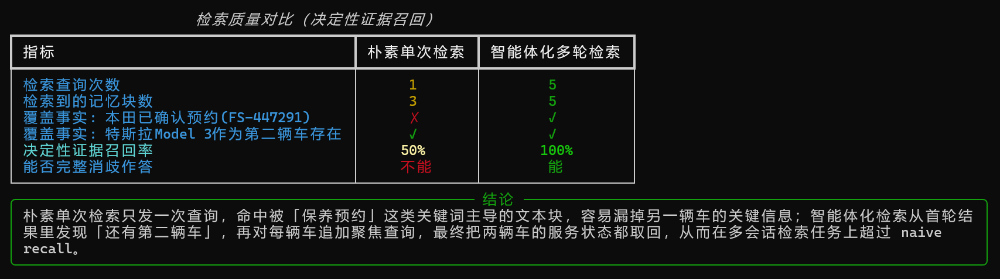

# 实验 3-9：利用 Agentic RAG 检索跨会话记忆

## 资料链接

- 概念笔记：[Context、Memory 与 RAG](chapter2-3_context-memory-rag.md)
- 结果摘要：[3-9summary.md](../output/3-9_agentic-rag-memory/3-9summary.md)
- 原始结果：`../output/3-9_agentic-rag-memory/offline-demo.json`
- 实验输入：[01_multiple_vehicles.yaml](../../user-memory-evaluation/test_cases/layer2/01_multiple_vehicles.yaml)
- 实验脚本：[offline_demo.py](../../agentic-rag-for-user-memory/offline_demo.py)
- 检索轨迹截图：`../images/3-9-retrieval-trace.png`
- 结果对比截图：`../images/3-9-retrieval-result.png`

## 实验目的

本实验要观察：当用户的历史信息分散在多个会话和多个记忆块中时，一次检索是否足够，以及 Agent 能否通过“检索、观察、发现新线索、继续检索”找回更完整的长期信息。

实验比较两种策略：

| 策略 | 做法 |
| --- | --- |
| 朴素单次检索 | 直接使用用户原问题进行一次 BM25 检索。 |
| Agentic 多轮检索 | 首次检索后从结果中发现车辆实体，再围绕每辆车追加聚焦查询。 |

本实验不是在比较 BM25 与向量检索。两条路线使用同一个本地 BM25 后端，改变的只有查询策略。

## 运行命令

```bat
conda activate agentbook
cd /d "D:\study by my self\Agent\ai-agent-book\chapter3\agentic-rag-for-user-memory"
set PYTHONUTF8=1
python offline_demo.py --output "..\experiment\output\3-9_agentic-rag-memory\offline-demo.json"
```

运行环境：

```text
Python 3.11.16
PyYAML 6.0.3
本地 BM25
无 API Key
无外部检索服务
```

## 实验数据

用例中有两个历史会话：

1. `auto_insurance_001`：保险会话。它说明用户同时拥有 2019 Honda Accord 和 2023 Tesla Model 3。
2. `auto_service_001`：保养会话。Honda 已确认预约 30K 保养，确认号是 `FS-447291`；Tesla 的轮胎换位被讨论过，但用户最终只预约了 Honda。

当前问题故意使用含糊的单数表达 `my car`：

```text
I need to schedule service for my car. Can you tell me what services I have scheduled?
```

要完整回答，Agent 不能默认用户只拥有一辆车。它需要找回两辆车的状态，再向用户确认指的是哪一辆。

## 从历史会话到可检索记忆

脚本使用固定轮数分块：每块最多 20 轮，相邻块重叠 2 轮。

```text
保险会话：50 轮 -> 3 块
保养会话：47 轮 -> 3 块
总计：2 个会话 -> 6 个记忆块
```

分块之后，脚本把每块文本和 metadata 加入本地 BM25 索引。这里的历史会话位于当前 Context 之外，更准确地说，它们是持久化的原始会话轨迹库；只有被检索命中的相关块，才有机会进入后续 Agent 的运行时 Context。

## 实际运行轨迹



### 策略 A：朴素单次检索

朴素路线只发送原问题一次，取回 3 个块：

```text
auto_service_001#1-20
auto_insurance_001#1-20
auto_service_001#19-38
```

这些块足以证明 Tesla Model 3 是第二辆车，却没有覆盖保养会话末尾包含 `FS-447291` 的块。因此它只找到 1/2 条决定性证据，召回率为 50%。

这说明首轮结果并非完全错误，而是**不完整**。对于需要消歧的 Agent，漏掉一条决定性证据就可能让它错误地把“我的车”解释为某一辆车。

### 策略 B：Agentic 多轮检索

Agentic 路线首先执行相同的原问题查询，然后从首轮结果中抽取车辆实体：

```text
Honda
Tesla
Honda Accord
Tesla Model
```

接着生成四次聚焦查询：

```text
Honda service appointment scheduled
Tesla service appointment scheduled
Honda Accord service appointment scheduled
Tesla Model service appointment scheduled
```

这些查询都命中了保养会话的尾部块 `auto_service_001#37-47`，其中保存了 Honda 的最终预约确认号。五次查询的结果按块 ID 去重后共有 5 个记忆块，最终覆盖两条决定性证据，召回率从 50% 提升到 100%。



## JSON 结果解读

| 指标 | 单次检索 | Agentic 多轮检索 |
| --- | ---: | ---: |
| 查询次数 | 1 | 5 |
| 去重后的记忆块数 | 3 | 5 |
| 本田预约证据 | 未召回 | 已召回 |
| Tesla 第二辆车证据 | 已召回 | 已召回 |
| 决定性证据召回率 | 50% | 100% |

这里的 100% 不能读成“Agent 的最终答案 100% 正确”。脚本只检查两条 marker：`FS-447291` 和 `Model 3`。它没有检查日期、价格和服务项目是否被完整回答，也没有实际调用模型生成最终答案。

## Context、Memory、RAG 在实验中的位置

| 概念 | 本实验中的对应物 |
| --- | --- |
| Memory | 两段保存在 YAML 中的跨会话原始历史，以及切分后的 6 个记忆块。 |
| RAG Retrieval | 使用 BM25 根据当前问题找出相关记忆块。 |
| Agentic Retrieval | 根据已召回内容发现 Honda/Tesla，再生成后续查询。 |
| Context | 如果接入真实 LLM，被召回的块会作为证据加入下一轮模型输入。 |

本离线演示真正执行到了 Retrieval 和证据评估，但没有执行最后的 LLM Generation。因此它证明的是“多轮查询扩大了决定性证据召回”，而不是完整证明一个端到端 Agent 已经生成了正确回答。

## 为什么日志写着 `HYBRID`，实际仍是 BM25

终端同时出现了：

```text
Using built-in local BM25 backend
Initialized indexer with mode: IndexMode.HYBRID
```

这两句描述的是不同层次：`HYBRID` 是配置对象中的默认检索模式；但 `offline_demo.py` 强制选择 `local` backend，而本地 backend 的实现只有 BM25。没有启动外部 pipeline，也没有 embedding 或向量索引，所以本次实际执行的仍是纯 BM25。

## 我的分析

### 多轮检索解决的是“不知道自己漏了什么”

单次检索已经找到了与问题最相似的三个块，但 Top-K 排名会截断后面的信息。Agentic 路线的价值不是让 BM25 本身变聪明，而是让上层控制逻辑读完第一批结果后，根据新出现的实体改写查询，从不同角度再次访问同一个记忆库。

这与 ReAct 很相似：第一次检索结果是 Observation，后续聚焦查询是新的 Action。只有 Action 和 Observation 多轮闭环，Agent 才有机会发现首轮 Top-K 之外的决定性信息。

### 更高召回是用更多成本换来的

查询数从 1 增加到 5，去重记忆块从 3 增加到 5。召回更完整，但检索次数、延迟和进入 Context 的候选内容也更多。

此外，实体抽取同时产生了 `Honda` 与 `Honda Accord`、`Tesla` 与 `Tesla Model`，四次追加查询存在明显重复。真实 Agent 需要做实体归一化和停止判断，否则“主动检索”可能演变成重复检索。

### 原始会话日志不等于整理好的长期记忆

本实验把长对话直接分块并当作可检索记忆，这种做法保留细节和来源，但也保留大量冗余内容。更成熟的长期记忆系统还需要提取稳定事实、处理更新与冲突，并在必要时回到原始会话核验细节。

因此，我把本实验理解为“在持久化会话轨迹之上增加 RAG 读取能力”，而不是已经完成了长期记忆的全部生命周期。

## Embodied AI 迁移

可以把多车辆场景换成机器人维护场景：用户问“我的机械臂安排了什么维护？”历史中可能同时出现 `UR5-02`、夹爪和移动底盘。一次搜索也许只找到最近一次 UR5 校准记录；Agent 应从首轮结果发现其他设备实体，再分别查询维护状态，最后说明哪些设备已经预约、哪些只是讨论过。

对 embodied Agent 还需要增加两个约束：

1. 长期记忆必须带时间与来源，因为历史上的路线、设备状态可能已经过期。
2. 检索到的历史经验不能覆盖实时传感器观察；高风险动作必须用当前环境再次验证。

## 实验局限

1. Agentic 路线由规则模拟，不是 LLM 自主生成检索计划。
2. 只运行了一个测试用例，证据集合只有两个 marker。
3. 只测试 BM25，没有比较向量检索或真正的混合检索。
4. 指标只衡量证据召回，不衡量最终回答质量、延迟或 token 成本。
5. 实体查询存在重复，尚未实现去重、预算控制和动态停止。
6. JSON 没有保存每个命中块的完整文本，复核时仍需结合 YAML 和 CMD 输出。

## 我的总结

实验 3-9 让我看到，RAG 不只是“搜一次文档再回答”。当问题含糊、相关事实分散在多个会话时，Agent 可以把检索当作工具：先取回一部分记忆，从结果中发现新的实体或信息缺口，再继续查询。

我目前对三者关系的理解是：历史会话作为外部 Memory 保存，BM25 负责 Retrieval，被召回的相关片段才会进入运行时 Context。Agentic RAG 的增量价值在于控制检索过程，而不是改变底层检索器本身。
