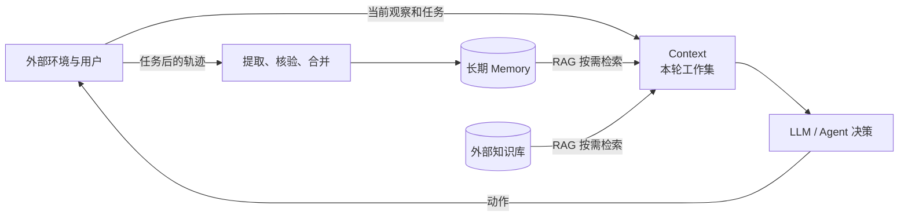

# Chapter 2～3 学习笔记：Context、Memory 与 RAG

> 一句话总览：
**Memory 和知识库保存窗口外的信息**
**RAG 负责按当前任务取回相关内容**
**Context 则是模型这一轮真正能够看到和使用的工作集**

## 书中位置

建议按下列顺序阅读，不必从头逐字读完两章。

| 知识点 | 对应正文 | 阅读重点 |
| --- | --- | --- |
| Context 的定义 | [第 2 章：上下文：决定 Agent 能力上限的关键](../../../book/chapter2.md#上下文决定-agent-能力上限的关键) | Agent 的行动依赖截至当前的交互上下文，而不只依赖最后一句话。 |
| API 中如何组织 Context | [第 2 章：Agent 如何调用大模型](../../../book/chapter2.md#agent-如何调用大模型理解-api-的上下文结构) | 四种消息角色、`tools` 字段、API 无状态。 |
| Context 的实际构成 | [第 2 章：从 API 视角看上下文的构成](../../../book/chapter2.md#从-api-视角看上下文的构成) | 静态前缀与动态轨迹。 |
| 窗口为什么需要管理 | [第 2 章：上下文压缩策略](../../../book/chapter2.md#上下文压缩策略) | 长度、成本、注意力与压缩。 |
| 长期记忆是什么 | [第 3 章：用户记忆系统](../../../book/chapter3.md#用户记忆系统) | 从会话中选择、抽象并结构化长期有用的信息。 |
| 短期与长期的分层 | [第 3 章：记忆的层次结构](../../../book/chapter3.md#记忆的层次结构) | 轨迹是流水账，长期记忆是档案。 |
| RAG 的基本职责 | [第 3 章：RAG 基础](../../../book/chapter3.md#rag-基础构建-agent-的知识获取管道) | 检索相关片段，再把片段注入上下文供模型生成或决策。 |
| RAG 如何用于长期记忆 | [第 3 章：智能体化 RAG](../../../book/chapter3.md#智能体化-rag将知识检索工具化的范式转变) | 继续读该节中的实验 3-9：把历史会话当知识库，通过工具进行多轮检索。 |

## 1. Context：模型当前桌面上的材料

### 1.1 感性认识

可以把 LLM 想成正在执行任务的机器人“大脑”，上下文窗口是它当前工作台能摊开的材料。机器人正在执行“把电池送到 B 实验室”时，工作台上可能有：

- 安全规则：不能进入有人作业的机械臂区域。
- 当前目标：把电池送到 B 实验室。
- 当前观察：相机识别到前方门关闭，力传感器读数正常。
- 最近轨迹：已经经过 A 走廊，刚才导航工具报告东侧通道拥堵。
- 工具说明：可以调用地图检索、导航和抓取工具。
- 按需取回的信息：B 实验室门宽、历史上成功通过的路线。

真实环境并不等于 Context。房间、门和人仍在模型外部；只有传感器结果、文字描述、图像 token、地图片段等被送进请求后，才成为模型可见的 Context。

### 1.2 上下文窗口是什么

上下文窗口是**一次模型推理能够接收并关注的有限 token 范围**。它不是永久记忆，也不是环境本身。窗口再大也仍有三类问题：

1. 容量有限，长对话和工具输出最终会占满窗口。
2. 输入越长，通常成本和延迟越高。
3. 信息放进窗口不等于模型一定能稳定使用；中间位置的信息可能被忽略，冗余内容也会稀释注意力。

LLM API 通常是无状态的。第 3 次请求不会天然记得前两次请求，Agent 框架必须重新构造本轮需要的消息列表。

### 1.3 Agent 如何组织 Context

书中的 API 结构可以归纳为：

```text
Context = 静态前缀 + 动态轨迹 + 当前状态 + 按需取回的信息
```

| 部分 | 典型内容 | 变化特点 |
| --- | --- | --- |
| 静态前缀 | system 指令、核心工具定义 | 尽量稳定，便于复用缓存 |
| 动态轨迹 | user、assistant、tool 消息 | 随 ReAct 循环持续增长 |
| 当前状态 | 任务进度、未完成项、计数、关键约束 | 常放在靠近上下文末尾的位置 |
| 按需信息 | Skill、RAG 检索结果、相关长期记忆 | 只在当前任务需要时加载 |

书中四种消息角色是：

- `system`：开发者设定的身份、规则和约束。
- `user`：用户当前或历史输入。
- `assistant`：模型过去的回复或工具调用请求。
- `tool`：工具执行后返回的观察结果。

工具定义通常放在请求顶层的 `tools` 字段中，不是第五种消息角色。

组织上下文的核心不是“塞得越多越好”，而是让模型在当前决策点看到**足够、相关、结构清楚且来源可信**的信息。常见手段包括稳定前缀、保留最近轨迹、在末尾维护状态摘要、按需加载 Skill/RAG，以及压缩较早的工具结果。

## 2. Memory: 短期上下文与长期记忆

### 2.1 最重要的区别

短期上下文回答：“**我这一轮正在处理什么，刚刚发生了什么？**”

长期记忆回答：“**跨过本次会话后，未来仍值得保留什么？**”

| 维度 | 短期上下文 / 运行时轨迹 | 长期记忆 |
| --- | --- | --- |
| 生命周期 | 当前任务或当前会话 | 跨会话、跨 Agent 实例 |
| 模型是否直接可见 | 已在本轮请求里，可直接使用 | 通常在外部存储中，需读取或检索后才能使用 |
| 内容形态 | 最近消息、工具调用、观察、临时计划 | 偏好、稳定事实、经验摘要、关系与时间信息 |
| 写入方式 | ReAct 循环自然追加 | 经过选择、提取、核验、合并和更新 |
| 容量约束 | 受上下文窗口直接限制 | 存储可以很大，但检索和维护会越来越难 |
| 主要风险 | 窗口溢出、注意力稀释、关键步骤丢失 | 记错、过时、冲突、隐私泄露、检索不到 |

### 2.2 一个容易误判的地方

把完整聊天记录保存成 JSON，只能说明**轨迹被持久化了**，不等于系统已经拥有好用的长期记忆。

长期记忆还需要回答：哪些信息值得保留？如何去重和更新？发生冲突时信谁？当前任务怎样找回相关内容？因此，长期记忆不是简单的“永久聊天记录”，而是有写入、整理、检索和遗忘机制的外部系统。

在 embodied AI 中也一样。把机器人全部相机视频存到硬盘是日志归档；从多次任务中提炼出“雨天地砖区域制动距离更长”，并在下次下雨时主动取回，才更接近可用的长期记忆。

## 3. RAG：把窗口外的信息取回窗口内

RAG 是 Retrieval-Augmented Generation，即检索增强生成。它的最小流程是：

```text
当前问题 → 检索相关片段 → 将片段加入 Context → LLM 生成答案或决定动作
```

RAG 在 Agent 中承担三项核心作用：

1. **扩展可用知识范围**：模型不必把所有文档、历史会话或地图都常驻窗口。
2. **提供较新或私有的信息**：外部知识库可以独立更新，不必重新训练模型。
3. **为行动提供证据**：Agent 可以先检索、观察结果，再决定是否继续检索或调用其他工具。

RAG 不等于向量数据库。检索器可以是 BM25、向量检索、混合检索、图检索或文件系统搜索。RAG 也不等于 Memory：

- Memory 关注“保存什么、如何更新、保留多久”。
- RAG 关注“面对当前问题，怎样找回最相关的内容并交给模型”。

当长期记忆很小时，可以把关键事实直接常驻 Context，不一定需要 RAG；当记忆规模变大时，RAG 才成为**从长期记忆中按需召回细节的关键机制**。

普通 RAG 往往只检索一次。Agentic RAG 把检索变成工具，模型可以根据第一次结果发现信息缺口，再改写查询、继续检索，直到证据足够。

## 4. 三者之间的关系



因此，三者不是三个并列的“记忆类型”：

- Context 是模型当前能看到的信息边界。
- Memory 是模型窗口外的持久信息资产。
- RAG 是把外部 Memory/知识库与当前 Context 连接起来的读取机制。

## 5. 常见的五类检索方式

| 方式 | 主要依据 | 擅长 | 局限 | Embodied AI 例子 |
| --- | --- | --- | --- | --- |
| BM25 | 查询词与文档词的精确重合，并考虑词频、词的稀有程度和文档长度 | 型号、编号、专有名词、错误码 | 不理解同义表达，换一种说法可能漏检 | 搜索精确设备编号 `C-17` 或故障码 `E042` |
| 向量检索 | 查询与文档 embedding 的语义距离 | 同义词、自然语言意图、模糊描述 | 对编号和细微否定有时不敏感；需要 embedding 与向量索引 | “电量不足时去哪里”匹配“低电量应返回充电区” |
| 混合检索 | 同时运行 BM25 与向量检索，再融合或重排结果 | 同时兼顾精确词和语义 | 系统更复杂，需处理两路分数和去重 | 同时理解“抓取失败”语义并精确命中机械臂 `UR5-02` |
| 图检索 | 实体和关系组成的节点、边以及多跳路径 | 关系推理、路径依赖、多实体关联 | 建图和更新成本高，错误关系会传播 | 查询“哪扇门连接实验室 B，且机器人尺寸能够通过” |
| 文件系统搜索 | 目录层级、文件名、metadata 和文本匹配 | 结构清楚、规模可控、需要可审计的知识 | 语义召回较弱，目录设计质量影响很大 | 按 `maps/building-b/floor-2/` 找地图和安全规程 |

BM25 是一种经典的**稀疏、词法检索**。直觉上，一个词在当前文档中出现得较多会提高相关性；一个词在整个语料中很少见，也会获得更高权重；同时算法会做文档长度归一化，避免长文档仅因词多而占便宜。

向量检索通常称为**稠密检索或语义检索**。它先分别编码查询和文档，再比较余弦相似度或距离。它擅长“说法不同但含义相近”的情况，但不应被误解为真正理解了全部事实关系。

混合检索常见的工程流水线是：

```text
BM25 候选 + 向量候选 → 融合（如 RRF）→ 神经重排序 → 返回 Top-K
```

图检索不是按“文本像不像”来找，而是沿显式关系搜索。例如从“机器人 R1”沿着“当前位于”“门连接”“房间包含”等边做多跳查询。文件系统搜索则利用人已经设计好的层次结构；它朴素但透明，在 Agent 能使用 `list`、`find`、`rg` 等工具时仍然非常实用。

## 6. 自测

先不看答案，用自己的话回答：

1. 为什么模型支持 128K 上下文，仍不能说它拥有长期记忆？
2. 第 3 次 API 调用为什么要再次携带前两轮中仍然有用的信息？
3. 机器人相机看到一扇门，这扇门本身、相机图像、视觉模型输出的“门已关闭”三者中，哪些可能成为 LLM Context？
4. 保存全部对话日志与建立长期记忆系统有什么区别？
5. RAG 检索到一段历史经验后，这段经验要进入哪里，模型才能据此行动？
6. 为什么“长期记忆”和“RAG”不能当作同一个概念？

### 参考答案

1. 128K 只描述单次推理的有限输入容量；内容不会天然跨会话保留，而且长窗口仍有成本、位置偏差和注意力稀释问题。
2. API 本身通常无状态，Agent 框架需要为每轮重新构造足够的 Context。
3. 门属于外部环境，不直接是 Context；图像被编码并送入多模态模型时可以成为 Context，“门已关闭”的观察文本被加入消息时也可以成为 Context。
4. 日志是原始流水账；长期记忆需要选择、抽象、核验、结构化、更新、冲突处理和可检索机制。
5. 进入下一轮模型请求的 Context。
6. 长期记忆是被保存和维护的信息；RAG 是按当前任务检索信息并注入 Context 的读取过程。

## 7. 下一步实验

下一步选择书中实验 3-9 的离线路径：`chapter3/agentic-rag-for-user-memory/offline_demo.py`。

它会把两个历史会话分块并建立本地 BM25 索引，然后比较：

- 朴素单次检索：只用用户原问题查一次。
- Agentic 多轮检索：从首轮结果发现车辆实体，再发起聚焦查询。

这个实验不需要 API Key 或 4242 服务，适合在五小时任务中先稳定跑通。它将直接展示：历史会话位于当前窗口外，RAG 从长期对话记录中找回相关记忆，命中的片段才会成为 Agent 后续回答所依据的 Context。

实验中的“多辆车与保养记录”也可以迁移到 embodied AI：机器人首次检索只找到一个房间或一台设备时，应根据结果中的实体线索继续追查其他相关对象，而不是把第一个命中当作完整世界状态。
