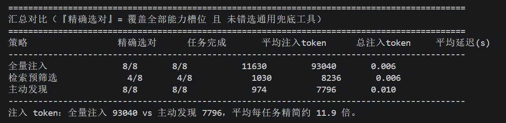
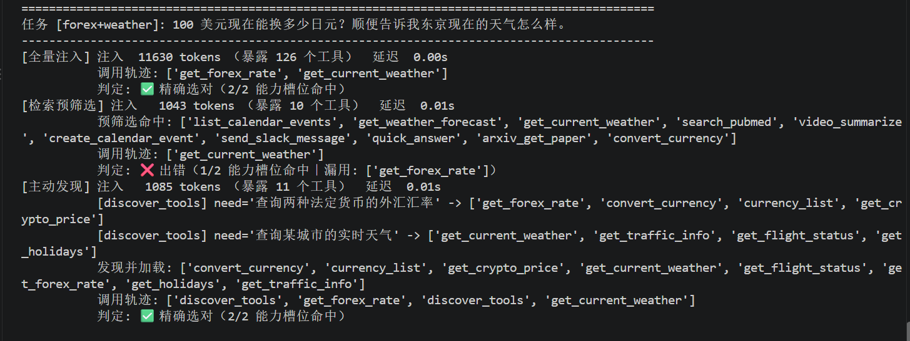

# 实验 4-1：主动工具发现（离线机制对照）

## 资料链接

- 书中对应章节：[工具太多怎么办：主动工具发现](../../../book/chapter4.md)
- 实验说明：[active-tool-discovery/README.md](../../active-tool-discovery/README.md)
- 客观结果摘要：[4-1summary.md](../output/4-1_active-tool-discovery/4-1summary.md)
- 实验入口：[demo.py](../../active-tool-discovery/demo.py)
- 三策略 ReAct 循环：[agent.py](../../active-tool-discovery/agent.py)
- 离线嵌入与脚本模型：[offline_backend.py](../../active-tool-discovery/offline_backend.py)
- 工具库与判分：[tools_library.py](../../active-tool-discovery/tools_library.py)
- 原始 JSON：`../output/4-1_active-tool-discovery/offline-all-tasks.json`（仅本地保留）

## 我为什么选择这个实验

这个实验能在一小时内完成，不需要 API Key，也不会真的修改日历、下载文件或发送消息；同时它包含一个很典型的 Agent 架构问题：工具从几十个增长到上百个后，是否应该把所有 schema 一次性塞给模型，还是让 Agent 在需要时再发现工具。

本次选择的是 `demo.py --offline` 教学路径，而不是实验账本中的正式真实工具 campaign。目标是理解三种 Context 组织方式和 Harness 控制流，并用本地可复现数据观察 token 差异；准确率只作为规则路由器的机制自检。

## 核心问题

当工具库有 126 个工具时，比较三种策略：

| 策略 | 初始 Context | 后续行为 | 主要风险 |
| --- | --- | --- | --- |
| 全量注入 | 126 个完整工具 schema | 直接选工具 | 工具墙占用大量 token，真实小模型可能受干扰。 |
| 检索预筛选 | 按整句任务一次检索 top-10 | 只能使用这 10 个 | 初始检索可能漏掉某个子任务；也可能有合适替代工具但模型不会改选。 |
| 主动发现 | 基础工具 + `discover_tools` | 每遇到一个能力缺口就检索 top-4 并加载 | 需要更多步骤；检索候选仍可能夹杂无关工具。 |

需要回答的不是“哪个终端数字最大”，而是：Context 在哪一层缩小、工具选择由谁完成、离线模式中的“Agent”究竟有多少真实自主性。

## 环境准备

确认解释器：

```text
Python 3.11.16
C:\Users\asus\.conda\envs\agentbook\python.exe
Conda 环境：agentbook
```

实验最初缺少 `tiktoken`，安装后版本为 `0.14.0`。`python -m pip check` 仍显示共享环境中一些既有包缺依赖，但本实验离线路径不导入它们，因此没有为了追求全局 `pip check` 变绿而继续安装无关包。

`demo.py --help` 中写着旧编号“实验 8-4”，Chapter 4 README 与实验账本已把它重编号为 4-1。本笔记按当前章节编号记录。

## 两次运行

先用单任务探针确认三条策略都能跑通：

```bat
python demo.py --offline --tasks finance+news --strategies full,prefilter,discovery --output "..\experiment\output\4-1_active-tool-discovery\probe-finance-news.json"
```

探针中三种策略都选对了股票与新闻两个能力；全量注入 11,630 token，预筛选 1,022，主动发现 1,019。这个任务只能验证流水线，不能显出预筛选的弱点。

随后运行全部 8 个任务：

```bat
python demo.py --offline --strategies full,prefilter,discovery --tool-set-size 126 --top-k 4 --prefilter-n 10 --max-steps 10 --output "..\experiment\output\4-1_active-tool-discovery\offline-all-tasks.json"
```

输出共包含 24 条记录，原始 JSON SHA-256 为：

```text
1CC3F80D5B3781BE2923862138213F67F916EFB8DFA10B7F7FD39D707959CE01
```

## 离线模式为什么能“像 Agent 一样运行”

它没有真正做网页搜索，也没有 LLM。离线路径把通常由模型和外部工具承担的部分替换成了确定性组件：

```text
任务文本
  ↓
MockChatClient：关键词规则决定下一目标工具
  ↓ JSON action
_run_loop：解析、校验、执行、回填 observation
  ↓
LocalEmbedder / ToolIndex：需要发现时做本地哈希相似度检索
  ↓
TOOL_IMPLS → _mock_result：返回固定的本地 JSON
  ↓
下一轮 action，直到 finish
```

### `LocalEmbedder`

它把英文词、中文单字和相邻中文二元组放入 512 维哈希词袋向量，归一化后用余弦相似度排序。它能利用词面重叠找工具，但不具备真正的语义理解。

### `MockChatClient`

它用正则规则把“股票”“新闻”“论文”“下载”等词映射到固定首选工具。例如“股价”映射 `get_stock_price`，“新闻”映射 `search_news`。如果首选工具当前不可用：主动发现模式会先调用 `discover_tools`；其他模式会尝试一次该工具，收到不可用提示后放弃该子任务。

### `_run_loop` 与 mock 工具

Harness 循环是真实执行的：它维护消息、解析 JSON action、检查当前可用工具、执行函数并把 observation 加回消息。但全部工具实现最终都走 `_mock_result`，所以 `search_news` 只是返回固定的 Reuters/Bloomberg 示例条目；下载、日历、天气也都没有真实外部副作用。

因此，本实验实现了真实的“控制循环”，但把“模型决策”和“世界交互”都 mock 掉了。

## 完整结果



| 策略 | 精确选对 | 总注入 token | 平均注入 token | 平均暴露工具 | 平均本地耗时 |
| --- | ---: | ---: | ---: | ---: | ---: |
| 全量注入 | 8/8 | 93,040 | 11,630.0 | 126 | 0.0056s |
| 检索预筛选 | 4/8 | 8,236 | 1,029.5 | 10 | 0.0058s |
| 主动发现 | 8/8 | 7,796 | 974.5 | 10 | 0.0101s |

主动发现相对全量注入减少 91.6% 的 schema token，约精简 11.9 倍。它的本地耗时约为另外两组的两倍，是因为双能力任务需要两次发现；但这些都是毫秒级 Python 墙钟时间，不能用来预测真实 API 的 TTFT 或总延迟。

## 主动发现的 Action—Observation 轨迹

以 `finance+news` 为例：

```text
Action: discover_tools("查询某股票的实时价格与涨跌幅")
Observation: 返回 top-4 候选并动态加载
Action: get_stock_price(...)
Observation: 固定 mock 股价 JSON
Action: discover_tools("按关键词检索相关的最新新闻")
Observation: 返回另一组 top-4 候选并动态加载
Action: search_news(...)
Observation: 固定 mock 新闻 JSON
Action: finish
```

重要之处不是 mock 股价内容，而是两类能力没有同时出现在初始 system prompt。Agent 在第二个能力真正出现时再次检索，并把新 schema 作为后续消息追加，这就是“主动发现”与“一次预筛选”的控制流差别。

## 为什么预筛选只有 4/8



预筛选失败的四个任务是 `forex+weather`、`crypto+news`、`opinion(诱导)` 和 `academic(诱导)`，但原因需要拆开看：

- `crypto+news` 和 `academic(诱导)` 的 top-10 确实没有召回对应的加密货币或学术专用工具，属于检索漏能力。
- `forex+weather` 的 top-10 已有判分可接受的 `convert_currency`，但脚本模型只会尝试规则指定的 `get_forex_rate`。
- `opinion(诱导)` 的 top-10 已有可接受的 `get_news_by_source` 与 `get_top_headlines`，但脚本模型只会尝试 `search_news`。

所以“4/8”不是纯粹的 retriever 指标，它是本地哈希检索与固定首选工具路由规则共同产生的端到端机制结果。真实模型可能会识别等价工具，也可能产生本实验没有模拟的其他错误。

## 指标里最容易误读的地方

### `finished` 不等于完成

三组都是 8/8 `finished=true`，但预筛选只有 4/8 覆盖全部能力槽位。`finished` 只说明 mock 最终输出了 `finish`；当某个首选工具不可用时，它会放弃该子任务，仍然正常结束。

### “准确率”只检查工具名

`grade()` 检查实际调用的工具名是否覆盖预设槽位，并检查有无通用兜底工具。它不检查参数和返回内容。固定参数提示会让加密货币工具拿到 `AAPL`，东京天气拿到“北京”，但仍可判为工具选择正确。

因此更准确的叫法是“能力槽位覆盖率”或“工具选择精确率”，不是端到端答案准确率。

### token 是真的，但边界有限

工具 schema 被实际渲染为文本，再用 `tiktoken` 计数，所以 11,630 与 974.5 是可复现的本地 schema token 测量。但它没有包含真实模型服务可能增加的消息封装 token，也不是账单数字。

## 我的分析

### 主动发现缩小的是模型的动作空间

全量注入不仅多花 token，还让模型每一步面对 126 个候选动作。主动发现把动作空间分成两级：先从一个元动作 `discover_tools` 描述能力，再只在少量候选中选择实际工具。这个设计与分层规划很像，检索器相当于根据当前子目标动态生成局部 action space。

### 一次性预筛选的问题不只是 Top-K

如果任务由多个领域组成，整句查询的向量会把多个意图压进一个表示。某个强势意图可能占据 top-10，而执行过程中才明确的第二个能力没有位置。主动发现让每个子目标各自形成更纯的检索查询。

不过这次实验还暴露了另一层：即使候选集中已经有等价工具，决策器也必须会改选。检索召回与 Agent 选择不能混成一个指标；生产评测应分别记录“候选集中是否存在可接受工具”和“模型是否实际调用它”。

### 离线 8/8 是设计出来的机制上界

Mock 模型不会被 126 个 schema 干扰，主动发现的 `need` 又由规则直接生成，与工具描述高度对齐。因此全量和主动发现都 8/8 是一种确定性机制上界，不是现实中的模型能力对照。

正式实验还要引入真实模型的长上下文遵循、JSON 格式错误、错误工具选择、提前结束，以及真实工具的超时、鉴权和返回值不稳定。仓库账本的正式 4-1 campaign 正是另一层证据，不能被本离线结果替代。

## 实验局限

1. 没有真实 LLM；下一动作由关键词规则决定。
2. 没有真实 embedding；512 维哈希词袋主要依赖词面重叠。
3. 没有真实 web、股票、天气、下载或日历调用，工具结果全部是固定 JSON。
4. 判分忽略参数、工具结果和最终答案内容。
5. 只有 8 个手写任务，且规则、工具描述和任务关键词彼此高度配合。
6. 每个配置只运行一次；毫秒级 latency 易受本机噪声影响。
7. 没有改变工具库规模，尚未亲自验证“工具越多，全量注入差距越大”的曲线。
8. 预筛选的两次失败来自决策器不会改选等价工具，不能全算作检索失败。

## Embodied AI 迁移理解

机器人可能拥有导航、抓取、视觉、地图、日程、安全检查和设备诊断等大量工具。把全部动作 schema 每轮都交给模型，会增加 Context 和误选风险；主动发现可以让机器人先描述“我需要识别桌上的可抓取物”或“我需要规划无碰撞路径”，再加载对应的局部工具集。

但物理世界不能照搬本实验的 mock 判分：选对 `move_arm` 这个工具名远远不够，还要验证坐标系、速度、碰撞约束、当前传感器状态和执行回执。主动发现负责缩小候选动作，不负责替代安全门、参数校验和世界状态验证。

## 我的总结

这次实验让我把“工具发现”理解为 Context 与动作空间管理，而不是另一种工具调用语法。全量注入、一次预筛选和主动发现的差别，发生在工具 schema 何时进入 Context、检索针对整项任务还是当前子目标，以及 Agent 能否根据 observation 再决定下一步。

本地结果清楚证明了 schema token 可以缩小约 11.9 倍，也展示了多轮发现如何覆盖多个能力槽位；但 8/8 只属于脚本路由器。真正评价生产 Agent 时，应分别检查候选召回、工具选择、参数正确性、工具真实执行、最终答案和安全副作用。
