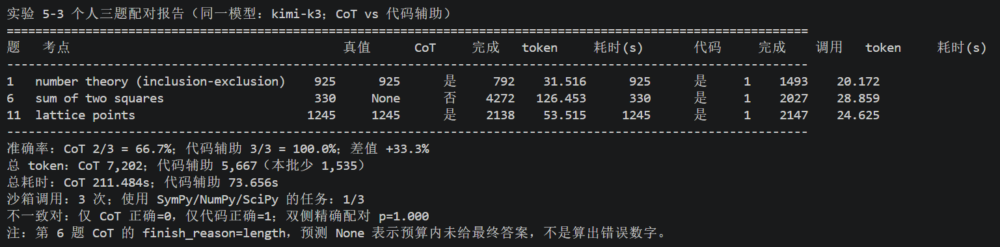
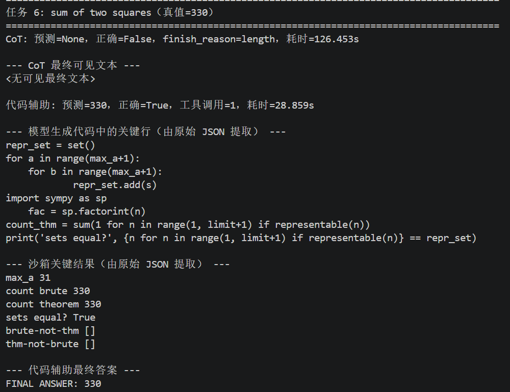

# 实验 5-3：使用代码工具辅助数学推理

## 资料链接

- 书中对应内容：[代码作为思考工具](../../../book/chapter5.md#代码作为思考工具)
- 实验说明：[code-for-math/README.md](../../code-for-math/README.md)
- 客观结果摘要：[5-3summary.md](../output/5-3_code-for-math/5-3summary.md)
- 实验入口：[demo.py](../../code-for-math/demo.py)
- 子进程执行器：[sandbox.py](../../code-for-math/sandbox.py)
- 原始题库：[problems.json](../../code-for-math/problems.json)
- 个人输入：[problem-6.json](../input/5-3_code-for-math/problem-6.json)、[problem-11.json](../input/5-3_code-for-math/problem-11.json)
- 脱敏汇总脚本：[report_5_3.py](../report_5_3.py)
- 原始 JSON：`../output/5-3_code-for-math/*.json`（仅本地保留）

## 对应书中内容

Chapter 5 把代码称为 Agent 的“元能力”：代码不只是最终产物，还可以临时创造新的计算、校验与表达能力。实验 5-3 聚焦最内层的一种用法——把代码当成思考工具。

LLM 擅长读懂自然语言题目、识别数学结构并写出求解步骤，但概率生成并不保证每一步算术、枚举或边界都正确。Python/SymPy 只能忠实执行形式化后的程序，却不会自动理解原问题。代码辅助 Agent 的分工因此是：

```text
模型：理解题目并形式化
  ↓ function call
Harness：校验并执行模型生成的 Python
  ↓ tool result / observation
模型：读取精确结果并生成最终答案
```

真正的实验变量不是“有没有在回答中展示代码”，而是 Harness 是否把代码作为工具真实执行，并把 stdout 结构化地回填给模型。

## 实验目的与个人范围

本次比较同一个 `kimi-k3` 模型在同一组题上的两个模式：

| 模式 | 允许的能力 |
| --- | --- |
| 纯 CoT | 只能自然语言推理，不暴露 `run_python`。 |
| 代码辅助 | 暴露 `run_python`，首轮强制至少一次真实工具调用；模型读取结果后再回答。 |

仓库正式验收包含 30 道 AIME 2024 题。个人实验为控制时间与费用，只选择三个互补的固定题：

1. 题 1：容斥，检查解析式与循环验证。
2. 题 6：二平方和，检查枚举结果去重。
3. 题 11：圆内格点，检查严格不等式边界与有序对。

这个三题样本足以理解闭环和失败类型，但不足以复现正式统计结论。

## 环境准备

```text
Windows / Anaconda Prompt
Conda 环境：agentbook
Python：3.11.16
openai：3.13.0
sympy：1.14.0
numpy：2.4.6
scipy：1.17.1
mpmath：1.3.0
```

最初虽然解释器属于 `agentbook`，Python 却从用户级目录加载了一个缺少 `mpmath` 的 SymPy：

```text
C:\Users\asus\AppData\Roaming\Python\Python311\site-packages
```

这是一种环境污染：正确解释器并不自动保证所有 import 都来自该环境。设置：

```bat
set PYTHONNOUSERSITE=1
```

后，确认 Conda 环境自身没有 SymPy，再把 `sympy/numpy/scipy` 安装进 `agentbook`。最终所有包路径均指向 `C:\Users\asus\.conda\envs\agentbook\Lib\site-packages`。

这里的教训是：排查 Python 环境既要看 `sys.executable`，也要看关键包的 `__file__`。

## 离线自检不是什么

命令：

```bat
python demo.py --selfcheck --verbose
```

结果为：

```text
参考解命中真值：11/11
全部通过：沙箱可用，题库真值自洽，可放心用于打分。
```

此时运行的是 `problems.json` 中人工准备的参考代码，不是 LLM 生成代码，也没有调用 API。11/11 证明题库与执行基础设施可用，不能写成“Agent 数学准确率 100%”。

## 真实运行与一次兼容性失败

最初使用 `kimi-k2.6` 运行第 1 题：CoT 正确得到 925，但代码臂返回：

```text
tool_choice 'required' is incompatible with thinking enabled
```

代码臂为了确保 treatment 真正发生，在第一次请求设置 `tool_choice='required'`。K2.6 thinking 模式只接受 `auto/none`，因此请求在生成代码前被拒绝。这不是数学失败，也不是沙箱失败，而是模型能力与 API 协议约束不匹配。

如果只对代码臂关闭 thinking，会同时改变思考模式与工具条件；如果改成 `auto`，又无法保证代码臂实际调用工具。为保持实验协议，后续改用项目为 Moonshot 配置的默认模型 `kimi-k3`，并保留失败 JSON。

三次成功运行均显式指定相同 provider 和模型；每个命令只跑一题，并在命令之间等待至少 65 秒以适配 3 RPM。完整命令与证据哈希见 summary。

## 实际 Agent 循环

代码臂每题都经历：

```text
Iteration 1
模型收到题目、run_python schema 和强制工具选择
模型返回 function call，其中 arguments.code 是 Python 源码

Harness
解析 tool arguments
把代码与预导入前缀写入临时 .py
使用当前 Python 启动子进程，超时上限 20 秒
收集 stdout/stderr，最多回填 4,000 字符
把结果作为 role=tool 消息加入 Context

Iteration 2
模型看到自己的 tool call 和环境 observation
输出 FINAL ANSWER: <整数>
```

模型负责提议代码；客户端 Harness 才真正启动子进程。Moonshot 服务端没有访问本地 Python 环境。

## 三题结果



| 题 | CoT | 代码辅助 | 关键差别 |
| ---: | --- | --- | --- |
| 1 | 925 ✓ | 925 ✓ | 代码用容斥公式并暴力验证。 |
| 6 | `None`，`length` | 330 ✓ | 代码用集合枚举与 SymPy 定理双重验证。 |
| 11 | 1,245 ✓ | 1,245 ✓ | 两臂都正确处理 `< 400`；代码用两种算法互验。 |

聚合结果是 CoT 2/3、代码辅助 3/3，表面差值 +33.3 个百分点。但只有第 6 题形成一个不一致对，双侧精确配对 `p=1.0`，不能声称显著提升。

## 第 6 题：最有信息量的轨迹



这题问 1 到 1000 中有多少不同整数可以写成 `a²+b²`。同一个整数可能由多个 `(a,b)` 表示，因此必须去重。

代码臂生成了两个独立判定：

1. 枚举 `a,b=0...31`，把和放入 `set`，得到 330。
2. 用 SymPy `factorint` 检查每个数的质因数分解：所有模 4 余 3 的素数指数必须为偶数，仍得到 330。

两个集合完全相同，空差集同时验证了枚举边界和定理实现。

CoT 臂耗尽 4,096 completion tokens，`finish_reason='length'`，没有可见最终文本，预测提取为 `None`。所以准确表述是“没有在预算内完成可判分答案”，而不是“心算给出了错误数字”。JSON 只保存最终 `content` 与 usage，没有保存 provider 的不可见 reasoning 内容，无法进一步定位它的内部推导。

## 第 11 题：代码并非唯一正确路线

题 11 中，CoT 成功把严格不等式改写为：

```text
|x| ≤ 19
max |y| = floor(sqrt(399 - x²))
```

再利用 x 的对称性得到 1,245。代码臂也正确，但额外做了两遍：直接遍历全部有序对，以及对每个 x 使用 `isqrt(r-1)` 统计 y。

这一题说明代码辅助不是“CoT 必错、代码必对”。当模型能够清楚处理对称性与边界时，纯推理同样有效；代码的主要价值变成可执行复核。

## Token 与耗时

| 指标 | CoT | 代码辅助 |
| --- | ---: | ---: |
| 总 token | 7,202 | 5,667 |
| 总耗时 | 211.484s | 73.656s |
| 平均耗时 | 70.495s | 24.552s |

不能据此总结代码辅助天然更便宜或更快。代码臂需要额外的 schema、tool call、tool result 和第二次模型请求；题 11 的代码总 token 实际略高。聚合优势主要来自题 6 的 CoT 在 126.453 秒内消耗满 4,096 completion tokens 却没有完成答案。

## 为什么只看最终正确率不够

本次至少需要同时检查五层：

1. 模型是否真正返回 function call，而不是在文本里贴代码。
2. Harness 是否实际执行代码，并保留 stdout/stderr。
3. 生成程序是否忠实形式化原题，例如是否去重、是否正确处理 `<`。
4. 模型是否读取 tool result 并输出规定格式的整数。
5. 最终整数是否与独立真值一致。

只看 `code_ok=true` 会漏掉代码偶然正确、参数错误、边界错误或没有实际执行的情况。第 6、11 题使用两种算法互验，比单独输出一个数字提供了更强的过程证据。

## Sandbox 的边界

`sandbox.py` 提供临时文件、独立子进程、20 秒超时、临时工作目录和 4,000 字符输出上限。这些措施能隔离崩溃、死循环和上下文爆炸，但不是生产安全边界：

- 子进程仍以当前 Windows 用户权限运行；
- 没有禁止网络；
- 没有文件系统白名单、容器、资源配额或系统调用过滤；
- 模型生成代码在 `--verbose` 打印前已经执行。

生产 Coding Agent 应使用容器、gVisor/虚拟机、无网络环境、只读文件系统、CPU/内存限制和独立权限账户。

## 我的分析

### 代码是外部可验证的工作记忆

CoT 的中间计算藏在生成序列里，错误和重复都很难被环境独立检查。代码把中间逻辑变成一个可执行 artifact：可以运行、打印、比较集合、写断言，也能被另一个验证器复核。tool result 再进入 Context 后，模型不需要在 token 中继续保存所有枚举状态。

### 精确执行不能修复错误形式化

Python 会精确执行错误程序。若模型把“不同整数”误写成“表示方法数量”，或者把 `<400` 写成 `<=400`，沙箱会稳定地产生错误答案。因此可靠性来自“模型形式化 + 执行器 + 独立真值/交叉验证”，而不是仅仅加入一个 Code Interpreter。

### Harness 厚度取决于模型边界

题 11 的 CoT 已能正确解决，代码只提供复核；题 6 的 CoT 在预算内无法收敛，代码把大规模枚举压缩为短程序。脚手架最有价值的区域，是模型能理解问题但不擅长稳定执行机械计算的边界。

### Provider 兼容性也是实验变量之外的工程事实

`kimi-k2.6` 的 400 发生在模型思考之前，却能让代码臂看起来是 0 分。如果只看最终表格，很容易把协议不兼容误判为模型不会数学。生产 Harness 必须验证模型是否支持所需的 tool choice、thinking 模式和消息格式，并把 provider error 与任务错误分开记录。

## 实验局限

1. 只有三题，每题每臂只运行一次；温度为推理模型要求的 1，存在随机性。
2. 题目不是随机抽样，而是为了展示三种机制有意选择。
3. 第 6 题差异是 CoT 输出预算耗尽，不是观察到错误数值。
4. 只有一个不一致对，`p=1.0`，没有统计显著性。
5. 三题都适合暴力枚举，不能代表证明题、连续优化或开放式数学研究。
6. 自动判分只检查最终整数，不评价证明质量。
7. 沙箱不是安全隔离环境。
8. 本次使用 `kimi-k3`，结论不能直接外推到其他模型或 provider。
9. 个人输入没有正式数据 manifest；正式 30 题 campaign 的验收门禁在本次保持 `official_complete=false`。

## Embodied AI 迁移理解

机器人也可以把代码当成思考工具。例如模型读懂“抓取前检查机械臂轨迹是否与安全区相交”，然后生成几何计算或约束求解代码，在仿真环境中枚举轨迹并返回碰撞点。模型负责把自然语言目标形式化，确定性程序负责坐标变换、距离、关节限制和碰撞检查。

但本实验的安全边界不能直接用于物理执行。模型生成的程序即使在数学上返回正确数字，也可能遗漏传感器时效、坐标系或速度限制。真实机器人必须让生成代码只运行在仿真/只读世界模型中，并由固定的安全控制器基于实时传感器真值决定是否允许动作。

## 我的总结

实验 5-3 让我看到，代码辅助的核心不是让模型“把推理换一种格式写出来”，而是把一部分推理交给模型之外的确定性执行器，并通过 Action—Observation 闭环把结果带回 Context。

三题中代码臂全部完成，CoT 在最依赖大规模去重枚举的题上没有在预算内作答；但样本太小，不能宣称显著提升。更可靠的结论是：代码最适合承担可执行、可验证、机械而易错的步骤，而问题形式化、代码审查、沙箱安全和最终验收仍然属于 Agent Harness 的责任。
